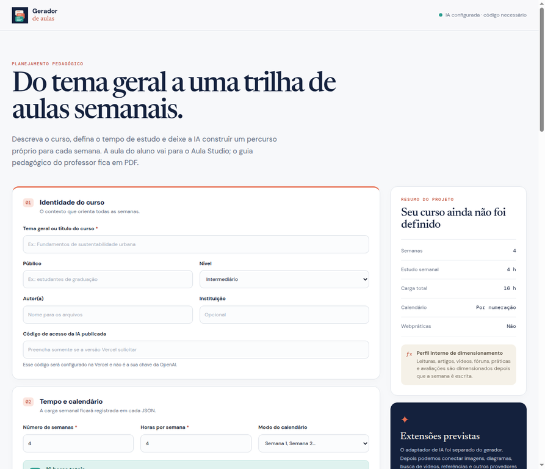
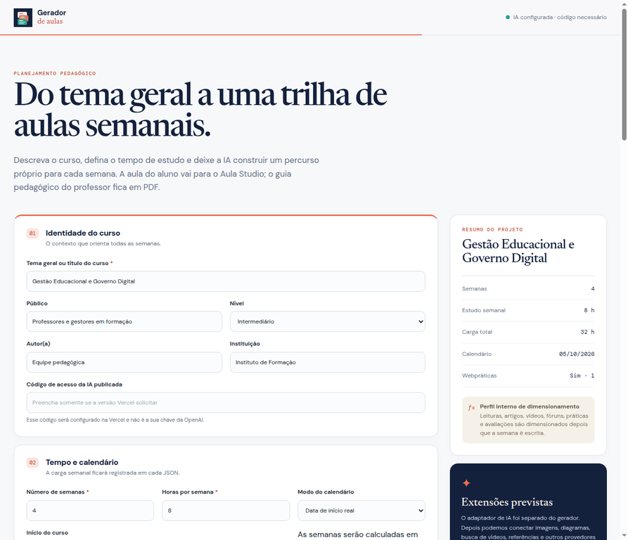
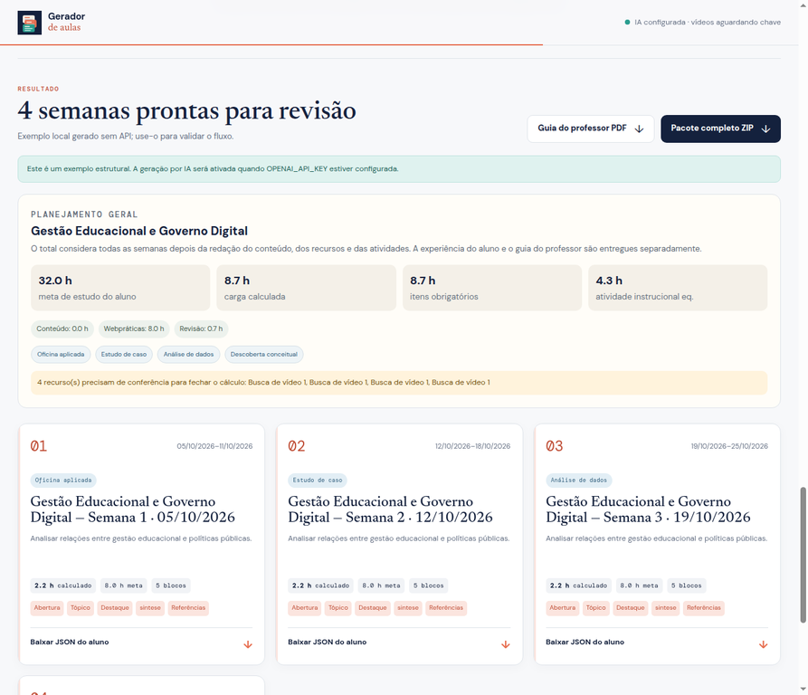
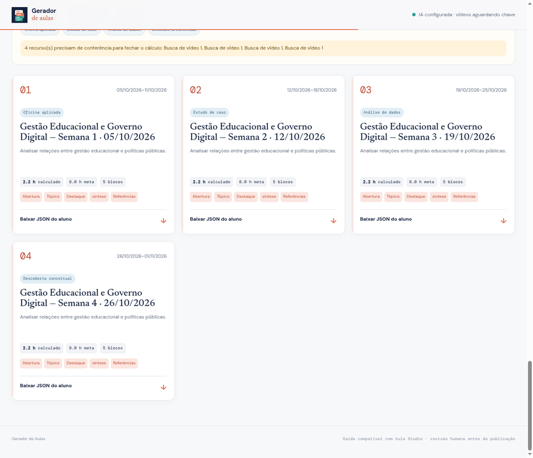

# Manual completo do Gerador de Aulas

## Da ideia inicial ao JSON semanal, guia do professor e publicação no Moodle

**Versão do manual:** 1.5
**Data:** 30 de setembro de 2026  
**Aplicação:** Gerador de Aulas  
**URL pública:** <https://aula-generator.vercel.app/>  
**Repositório:** <https://github.com/rgbittencourt/aula-generator>

<style>
pre, pre code { white-space: pre-wrap !important; overflow-wrap: anywhere !important; word-break: break-word !important; }
pre { font-size: 8.5pt !important; line-height: 1.28 !important; }
</style>

---

## Sumário

1. [Para que serve o Gerador de Aulas](#1-para-que-serve-o-gerador-de-aulas)
2. [O que é produzido](#2-o-que-é-produzido)
3. [Antes de começar](#3-antes-de-começar)
4. [Acesso à aplicação](#4-acesso-à-aplicação)
5. [Conhecendo a tela principal](#5-conhecendo-a-tela-principal)
6. [Fluxo completo de geração](#6-fluxo-completo-de-geração)
7. [Preenchendo o briefing](#7-preenchendo-o-briefing)
8. [Usando a IA para completar campos vazios](#8-usando-a-ia-para-completar-campos-vazios)
9. [Gerando as semanas com IA](#9-gerando-as-semanas-com-ia)
10. [Como a IA organiza cada semana](#10-como-a-ia-organiza-cada-semana)
10.1. [Perfil acadêmico e prompts do sistema](#101-perfil-acadêmico-e-prompts-do-sistema)
10.2. [Limites de tokens e geração sequencial](#102-limites-de-tokens-e-geração-sequencial)
11. [Webpráticas](#11-webpráticas)
12. [Materiais de apoio e recursos multimídia](#12-materiais-de-apoio-e-recursos-multimídia)
13. [Cálculo da carga de estudo](#13-cálculo-da-carga-de-estudo)
14. [Lendo o Planejamento Geral](#14-lendo-o-planejamento-geral)
15. [Revisando as semanas geradas](#15-revisando-as-semanas-geradas)
16. [Baixando os arquivos](#16-baixando-os-arquivos)
17. [Abrindo o JSON no Aula Studio](#17-abrindo-o-json-no-aula-studio)
18. [Publicando no Moodle via SCORM](#18-publicando-no-moodle-via-scorm)
19. [Configuração da OpenAI](#19-configuração-da-openai)
19.1. [Limite TPM e aumento de tier](#191-limite-tpm-e-aumento-de-tier)
20. [Pesquisa automática de vídeos, imagens e leituras](#20-pesquisa-automática-de-vídeos-imagens-e-leituras)
21. [Uso local e modo de exemplo](#21-uso-local-e-modo-de-exemplo)
22. [Problemas comuns e soluções](#22-problemas-comuns-e-soluções)
22.3. [Erro 429 de limite TPM](#223-erro-429-de-limite-tpm)
23. [Checklist de qualidade antes da publicação](#23-checklist-de-qualidade-antes-da-publicação)
24. [Estrutura técnica do JSON semanal](#24-estrutura-técnica-do-json-semanal)
25. [Perguntas frequentes](#25-perguntas-frequentes)
26. [Glossário](#26-glossário)

---

## 1. Para que serve o Gerador de Aulas

O Gerador de Aulas transforma um **tema geral de curso** em um planejamento semanal detalhado. A proposta não é simplesmente pedir à IA um texto genérico. O sistema combina briefing pedagógico, calendário, carga horária, materiais, webpráticas e pesquisa de recursos para produzir uma trilha que possa ser revisada e posteriormente aberta no Aula Studio.

O fluxo foi pensado para separar três funções que normalmente acabam misturadas:

- **Planejamento pedagógico:** objetivos, conteúdos, arco didático e sequência de aprendizagem.
- **Autoria da aula do aluno:** textos, blocos, vídeos, imagens, leituras, atividades, avaliação e síntese.
- **Mediação do professor:** intencionalidade, diagnóstico, perguntas, intervenções, diferenciação, acessibilidade e observações de condução.

A aplicação pode trabalhar com semanas numeradas ou com um calendário real. A interface principal é voltada à geração com IA; o fallback estrutural continua disponível apenas para testes técnicos internos, sem um botão exposto ao usuário.

> **Regra central:** a IA prepara uma primeira versão pedagógica; o professor continua responsável pela conferência das fontes, pela adequação ao público e pela publicação final.

---

## 2. O que é produzido

Ao concluir uma geração, o sistema disponibiliza o conteúdo semanal e os materiais do professor. Depois, o arquivo `.aula.json` do aluno pode ser aberto no Aula Studio e exportado no formato adequado ao uso final.

### 2.1 JSON do aluno

É um arquivo por semana, com a extensão `.aula.json`. Esse é o arquivo que deve ser aberto no Aula Studio.

Ele contém a experiência que será apresentada ao estudante, incluindo:

- abertura e título da semana;
- objetivos de aprendizagem;
- texto-base desenvolvido;
- seções e subseções;
- exemplos, casos e reflexões;
- vídeos, imagens, diagramas e leituras no ponto de uso;
- atividades;
- avaliação;
- síntese;
- referências;
- conexão com a próxima semana;
- cálculo e observações de carga.

O JSON do aluno **não deve conter o guia interno do professor nem qualquer webprática**. O campo `lessonPlan.webPractices` permanece vazio; a sessão prática é um produto separado em `teacherGuide.webPracticeProjects` e em DOCX.

### 2.2 Guia do professor em PDF

O PDF é separado da aula do aluno. Ele foi pensado para leitura na tela e inclui, quando disponível:

- propósito da semana;
- arco didático escolhido;
- objetivos e matriz de alinhamento;
- diagnóstico inicial;
- checagens formativas;
- perguntas de mediação;
- equívocos comuns;
- intervenções possíveis;
- diferenciação para apoio, percurso padrão e extensão;
- acessibilidade;
- observações de avaliação;
- revisão espiral;
- conferência dos recursos;
- recomendações de carga e qualidade.

### 2.3 Pacote completo ZIP do Gerador

O pacote reúne o curso inteiro em uma única estrutura:

```text
semanas/semana-01-titulo.aula.json
semanas/semana-02-titulo.aula.json
planejamento-geral.json
professor/guia-do-professor.pdf
webpraticas/01-tema/guia-e-roteiro.md
webpraticas/01-tema/pacote.json
webpraticas/01-tema/roteiro-webpratica.docx
webpraticas/01-tema/arquivos/*
```

### 2.4 Formatos de saída do Aula Studio

Depois de abrir o arquivo `.aula.json` no Aula Studio, use o menu **Exportar** para escolher o formato necessário:

| Opção | Arquivo gerado | Uso principal |
|---|---|---|
| **Projeto JSON** | `.aula.json` | Continuar editando, fazer backup ou abrir novamente no Aula Studio |
| **Arquivo HTML** | `.html` | Abrir diretamente no navegador como um arquivo único autocontido |
| **Pacote HTML** | `.html.zip` | Distribuir uma versão web com `index.html`, imagens, fontes e assets |
| **Pacote SCORM** | `.scorm.zip` | Importar no Moodle ou em outro LMS compatível com SCORM |
| **Imprimir PDF** | janela de impressão/PDF | Gerar uma versão estática para leitura ou arquivo |

O **JSON** é o formato editável do projeto. O **HTML** é a aula renderizada para navegador. O **SCORM** é um pacote HTML acompanhado de `imsmanifest.xml` e da ponte de comunicação com o LMS.

O pacote SCORM pode ser gerado em **SCORM 1.2**, opção padrão de maior compatibilidade, ou **SCORM 2004**, conforme a escolha feita na janela de exportação. Quando houver um quiz avaliativo, o pacote também pode receber a nota mínima de aprovação configurada.

---

## 3. Antes de começar

Antes da primeira geração real, tenha disponíveis quatro grupos de informações.

| Grupo | O que preparar |
|---|---|
| Identidade | Tema do curso, público, nível, autor e instituição |
| Organização | Número de semanas, horas por semana e data inicial, se houver |
| Conteúdo | Objetivos observáveis, conceitos, recortes, exemplos e abordagem desejada |
| Recursos | Referências, links conferidos, termos de busca, materiais e webpráticas |

Não é necessário que tudo esteja pronto. O botão **Preencher vazios com IA** ajuda a completar o briefing. Entretanto, quanto mais específico for o conteúdo fornecido pelo professor, mais útil será a geração.

### 3.1 O que torna um briefing bom

Um briefing forte informa não apenas o assunto, mas também o recorte pedagógico. Compare:

**Briefing fraco:**

> Gestão educacional.

**Briefing melhor:**

> Curso para gestores escolares em formação continuada. Trabalhar a relação entre políticas públicas, governo digital, sistemas de informação, indicadores acadêmicos e tomada de decisão. Usar exemplos brasileiros, estimular leitura crítica de dados e concluir com uma atividade aplicada.

A segunda versão oferece público, contexto, conceitos, recorte, finalidade e abordagem.

---

## 4. Acesso à aplicação

Abra a aplicação em:

<https://aula-generator.vercel.app/>

Na implantação atual, a IA está configurada e a aplicação pública exige um **código de acesso**. Esse código é o valor definido na variável `AULA_ACCESS_CODE` da Vercel. Ele não é:

- a chave da OpenAI;
- a senha do GitHub;
- a senha da conta ChatGPT;
- a chave `YOUTUBE_API_KEY`.

Digite o código no campo **Código de acesso da IA publicada**. Se o código estiver errado ou ausente, a geração protegida retornará erro de autorização.

### 4.2 Salvamento automático e recuperação

O Gerador salva automaticamente o briefing e, depois da geração, também salva as semanas, o Planejamento Geral, os guias do professor e o estado de revisão no navegador. Se houver queda de energia, atualização acidental ou fechamento inesperado, abra novamente a mesma URL no mesmo navegador e dispositivo.

Se existir um planejamento salvo, aparecerá a faixa:

> Encontramos um planejamento salvo neste navegador.

Clique em **Retomar planejamento** para restaurar o briefing e, quando disponível, as semanas já geradas. O campo do código de acesso não é salvo; informe-o novamente quando precisar gerar ou refazer uma semana.

Para maior segurança, clique em **Baixar backup** depois de uma geração importante. Guarde o arquivo `.json` em outro local. Em caso de perda do armazenamento do navegador, clique em **Restaurar backup** e selecione esse arquivo.

O autosave é local: ele não sincroniza entre computadores, perfis de navegador ou dispositivos. Para um planejamento importante, use os dois mecanismos: autosave e backup baixado.

### 4.1 Como interpretar o indicador do cabeçalho

O cabeçalho mostra o estado dos serviços. Exemplos:

| Indicador | Significado |
|---|---|
| **IA configurada · código necessário** | A OpenAI está disponível, mas é necessário informar o código privado |
| **IA configurada · vídeos aguardando chave** | A OpenAI está disponível; a busca de vídeos ainda não recebeu `YOUTUBE_API_KEY` naquele ambiente |
| **IA indisponível** | O backend não recebeu `OPENAI_API_KEY` ou houve falha na implantação |

Na versão pública atual, o ambiente de produção já foi validado com OpenAI e YouTube configurados. Ambientes locais podem mostrar outro estado porque usam variáveis próprias.

---

## 5. Conhecendo a tela principal

A tela principal é organizada como um ateliê de planejamento. No lado esquerdo ficam os campos do projeto; no lado direito aparece o resumo que acompanha as decisões.



*Figura 1 — Tela inicial, ainda sem um curso preenchido.*

### 5.1 Cabeçalho

O cabeçalho apresenta a marca, o status da IA e, quando o usuário rola a página, uma barra de progresso visual do briefing.

### 5.2 Painel de resumo

O painel lateral mostra continuamente:

- nome do curso;
- número de semanas;
- horas de estudo por semana;
- carga total prevista;
- modo do calendário;
- existência ou não de webpráticas;
- estado geral do dimensionamento.

Esse resumo é preliminar. O cálculo mais preciso acontece depois que o conteúdo e os recursos são gerados. Abaixo dele ficam as ações principais: **Preencher vazios com IA**, **Gerar com IA**, **Recalcular qualidade**, **Guia do professor PDF** e **Pacote completo ZIP**. Em telas amplas, ele ocupa a coluna esquerda; o formulário e o **RESULTADO** ficam na coluna central; e a navegação do projeto fica na coluna direita. A introdução “Do tema geral...” fica no alto da coluna central. Logo abaixo de **NAVEGAR PELO PROJETO** existe um segundo menu independente, **BACKUP E RECUPERAÇÃO**, com **Retomar planejamento**, **Baixar backup** e **Restaurar backup** quando aplicável. O cabeçalho permanece fixo e a rolagem global é bloqueada no desktop: cada coluna tem sua própria rolagem quando o conteúdo não cabe. Em tablets e telas menores, as colunas passam para uma disposição vertical, mas cada área continua podendo rolar de forma independente. Depois da capa, o menu superior permanece fixo desde a entrada no workspace e apresenta o atalho **Abrir Aula Studio**, com a marca do editor, em uma nova aba. Os campos Nome, Instituição e Código de acesso da capa começam vazios por decisão de privacidade, mas os três precisam ser preenchidos para entrar no workspace. A capa usa a assinatura institucional IFSC–INOVALAB e apresenta o crédito **Desenvolvido pelo Prof. Rogério G. Bittencourt**, com link para o perfil GitHub do autor.

O menu de navegação da coluna direita oferece atalhos para os sete setores do briefing e para **Carga por atividade**, **Carga aberta por atividade**, **Checklists** e **Semanas planejadas**. Os atalhos calculam a posição dentro da coluna central, sem deslocar a página inteira. No celular, a navegação passa para uma área própria abaixo do conteúdo.

Em monitores largos, a área útil do workspace é ampliada: o resumo e as ações ficam próximos da margem esquerda, a navegação se aproxima da margem direita, ambas as laterais mantêm largura fixa e a coluna central recebe todo o espaço restante para leitura e edição. Em tablets e telas menores, o layout passa para a disposição vertical responsiva.

Durante o uso, clique no logo **Gerador de Aulas** para iniciar um **novo projeto de disciplina** sem retornar à capa. Somente os formulários e resultados em edição são limpos; os dados de acesso permanecem na sessão e o planejamento salvo continua disponível no painel **Planejamento recuperável**, com **Retomar planejamento**, **Baixar backup** e **Restaurar backup**. Para encerrar a sessão e solicitar novamente Nome, Instituição e Código de acesso, use **Trocar acesso** no cabeçalho. Essa ação limpa o planejamento local e retorna à capa vazia.

### 5.3 Seções numeradas

A tela divide o briefing em sete áreas recolhíveis. Somente **Identidade do curso** começa aberta; os demais setores começam recolhidos para manter a tela compacta:

1. **Identidade do curso**
2. **Tempo e calendário**
3. **Recursos e leituras por semana**
4. **Composição da aula no Aula Studio**
5. **Intenção pedagógica**
6. **Webpráticas síncronas**
7. **Materiais de apoio**

Clique no cabeçalho de qualquer setor para recolhê-lo ou reabri-lo. O bloco externo **RESULTADO** também é um acordeão e, ao apresentar uma nova geração, começa recolhido. Dentro dele ficam quatro setores de resultado — **Carga por atividade**, **Carga aberta por atividade**, **Checklists** e **Semanas planejadas** — que também começam recolhidos. O símbolo no canto superior direito de cada cabeçalho indica o estado e permite expandir ou recolher o bloco. O bloco externo e cada setor interno podem ser abertos independentemente.

---

## 6. Fluxo completo de geração

O fluxo recomendado é o seguinte:

```text
Acessar a aplicação
        ↓
Informar o código de acesso
        ↓
Preencher identidade, calendário e objetivos
        ↓
Cadastrar webpráticas, se existirem
        ↓
Cadastrar materiais e sugestões de recursos
        ↓
Usar “Preencher vazios com IA”, se necessário
        ↓
Revisar o briefing preenchido
        ↓
Clicar em “Gerar com IA”
        ↓
IA escreve as semanas
        ↓
Sistema pesquisa candidatos de vídeos, imagens e leituras
        ↓
IA seleciona os candidatos mais adequados
        ↓
Sistema calcula a carga da semana e do curso
        ↓
Professor revisa Planejamento Geral e semanas
        ↓
Baixa JSON, PDF do professor ou ZIP
        ↓
Abre o JSON no Aula Studio
        ↓
Revisa e exporta SCORM para o Moodle
```

A etapa de geração não substitui a revisão. O produto ideal é uma **primeira versão consistente e editável**, não um material que deva ser publicado sem leitura humana.

---

## 7. Preenchendo o briefing

### 7.1 Identidade do curso

Preencha o tema geral com um nome que possa aparecer nos arquivos e no Aula Studio.

Exemplo:

```text
Gestão Educacional e Governo Digital
```

O campo **Público** deve informar quem estudará. Evite deixar apenas “alunos”. Prefira algo como:

```text
Professores e gestores em formação continuada
```

Em **Nível**, escolha Iniciante, Intermediário ou Avançado. O nível influencia o vocabulário, a profundidade e a quantidade de pré-requisitos.

**Autor(a)**, **Instituição** e **Código de acesso de IA** são solicitados na capa antes da entrada. Autor(a) e Instituição identificam os arquivos e a abertura no Aula Studio; o código é validado nas chamadas protegidas da versão publicada e não é salvo no backup local.



*Figura 2 — Exemplo de identidade, calendário e resumo preenchidos.*

### 7.2 Tempo e calendário

Informe:

- **Número de semanas:** de 1 a 52;
- **Horas por semana:** carga esperada de estudo do aluno;
- **Modo do calendário:** semanas numeradas ou data de início real;
- **Data inicial:** aparece quando o modo escolhido é calendário real.

No modo **Semana 1, Semana 2…**, o sistema não precisa de uma data de início.

No modo **Data de início real**, o sistema calcula cada semana em blocos de sete dias. Se a data inicial for 05/10/2026, a primeira semana será de 05/10 a 11/10, a segunda de 12/10 a 18/10 e assim por diante.

### 7.2.1 Recursos e leituras por semana

No painel **Recursos e leituras por semana**, informe o padrão do curso:

- **Vídeos por semana:** quantidade de vídeos que a IA deve procurar e contextualizar;
- **Artigos por semana:** quantidade de artigos acadêmicos que a curadoria deve localizar;
- **Leituras obrigatórias:** quantidade total de leituras que o estudante deverá realizar;
- **Nível da leitura obrigatória:** nenhuma, essencial, aprofundada ou densa.

Os artigos podem contar como parte das leituras obrigatórias. Portanto, se você definir um artigo e uma leitura obrigatória, o sistema tentará usar o artigo como essa leitura, sem duplicar artificialmente o material.

Abaixo dos padrões existe a tabela **Distribuição específica por semana**. Cada linha permite substituir os valores de uma semana. Deixe o campo como **Padrão** para herdar a configuração geral. Para não inserir um tipo de recurso em determinada semana, informe `0` naquela linha.

Exemplo:

| Semana | Vídeos | Artigos | Leituras obrigatórias | Nível |
|---|---:|---:|---:|---|
| Padrão | 1 | 1 | 1 | Essencial |
| Semana 1 | 0 | 2 | 2 | Aprofundada |
| Semana 2 | Padrão | 0 | 0 | Nenhuma |
| Semana 3 | 2 | 1 | 1 | Densa |

O pedido é enviado à redação semanal, à curadoria da IA e à pesquisa dos provedores. Se um provedor não retornar candidatos suficientes, a semana registra a pendência em vez de inventar links.

### 7.3 Objetivos de aprendizagem

Use verbos observáveis. Exemplos adequados:

```text
Analisar relações entre gestão educacional e políticas públicas.
Comparar dados e indicadores para apoiar decisões.
Aplicar conceitos em uma situação profissional.
Avaliar limites e possibilidades do uso de tecnologia na escola.
```

Evite objetivos vagos como:

```text
Conhecer gestão educacional.
Entender tecnologia.
Aprender sobre dados.
```

O objetivo deve indicar o que o estudante será capaz de fazer após estudar.

### 7.4 Conteúdos, recortes e orientações

Informe conceitos obrigatórios, exemplos que devem aparecer, região ou contexto, autores desejados e restrições.

Exemplo:

```text
Trabalhar gestão educacional, governo digital, sistemas de informação,
indicadores, learning analytics e dashboards. Usar exemplos brasileiros,
relacionar os conceitos à tomada de decisão de gestores e evitar uma
abordagem puramente técnica.
```

### 7.5 Preferência de arco didático

A opção padrão é **A IA escolhe em cada semana**. Essa é a recomendação para uma trilha variada.

Também é possível escolher uma preferência:

- Descoberta conceitual;
- Estudo de caso;
- Oficina aplicada;
- Análise de dados;
- Debate orientado;
- Revisão e síntese.

A preferência não é uma receita fixa. Mesmo que se escolha um arco, a IA pode adaptar a sequência quando outro percurso for pedagogicamente mais adequado.

### 7.6 Perfil acadêmico e metas de profundidade

O bloco **Perfil acadêmico do conteúdo** controla a exigência textual da geração. Ele não é apenas informativo: seus valores entram no planejamento da semana, no prompt de redação, na revisão crítica e no checklist antes da exportação.

A versão atual evita duplicidade com a **Identidade do curso**. A própria tela mostra um resumo dos dados herdados:

- **Tema/área:** herdado do tema geral ou título do curso;
- **Público:** herdado do campo Público;
- **Nível da turma:** herdado do campo Nível da turma;
- **Profundidade aplicada:** derivada automaticamente do nível escolhido.

Esses quatro dados não precisam ser preenchidos novamente. No perfil acadêmico ficam apenas as decisões específicas de rigor e dimensionamento:

| Campo | Como orientar o gerador |
|---|---|
| Estilo de citação | Autor-data, ABNT, APA ou sem preferência. |
| Escopo histórico/geográfico | Delimita exemplos, casos e fontes. |
| Meta de palavras | Piso mínimo de texto útil por semana; o gerador distribui a meta por seções e não aceita acréscimos marginais como correção. |
| Mínimo de seções | Garante progressão em partes legíveis, com títulos específicos. |
| Mínimo de referências | Piso de referências estruturadas que deverão ser conferidas. |
| Fontes acadêmicas/oficiais | Quantidade mínima de fontes institucionais, acadêmicas ou oficiais. |
| Autores e quadros teóricos | Orienta a abordagem, sem permitir citações inventadas. |
| Tópicos a evitar | Restringe abordagens ou conteúdos indesejados. |
| Política de fontes | Define que toda pendência deve ser sinalizada para revisão humana. |

As três opções finais controlam regras de rigor: **exigir contrapontos e limites**, **comparar conceitos próximos** e **exigir exemplo ou estudo de caso**. Se o curso não comportar uma dessas exigências, desmarque-a conscientemente e registre a decisão no planejamento.

---

## 8. Usando a IA para completar campos vazios

O botão **Preencher vazios com IA** trabalha sobre o briefing, não sobre a geração final das aulas.

Ele pode sugerir ou completar:

- público;
- objetivos observáveis;
- conteúdo-base;
- referências para conferir;
- termos de busca de vídeos;
- termos de busca de imagens e diagramas;
- webpráticas, quando o conjunto ainda estiver vazio;
- materiais de apoio alinhados aos objetivos.

A aplicação deve preservar o que já foi escrito. Portanto, se um campo estiver preenchido com uma decisão do professor, a IA não deve substituí-lo indiscriminadamente.

### 8.1 Como usar com segurança

1. Preencha o tema e o público.
2. Escreva pelo menos uma intenção ou objetivo.
3. Clique em **Preencher vazios com IA**.
4. Aguarde o preenchimento.
5. Leia todos os campos alterados.
6. Apague sugestões que não correspondam ao curso.
7. Corrija termos, nomes, recortes e referências.
8. Só depois clique em **Gerar com IA**.

A IA pode sugerir uma referência ou um termo de busca, mas não se deve tratar uma sugestão como fonte conferida. Links, DOI, autores, licença e duração precisam ser verificados.

---

## 9. Gerando as semanas com IA

Depois de revisar o briefing:

1. Confira o código de acesso.
2. Verifique se o título, os objetivos e as horas estão corretos.
3. Confirme se a webprática está ligada somente quando necessário.
4. Confirme materiais obrigatórios e opcionais.
5. Clique em **Gerar com IA**.
6. Aguarde a escrita do conteúdo, a pesquisa de recursos e o cálculo.

A geração pode envolver mais de uma etapa do backend. O sistema primeiro redige a semana e depois pode consultar YouTube, Wikimedia Commons e Crossref para localizar candidatos de recursos.

Por segurança, as semanas são processadas **uma por vez**. Uma unidade pode passar pelas etapas de planejamento acadêmico, redação, revisão crítica, eventual reparo, pesquisa de recursos e cálculo. Isso reduz picos de tokens por minuto, embora possa tornar a geração de um curso longo mais demorada. Em respostas temporárias 429 ou 503, o backend aguarda e tenta novamente automaticamente.

### 9.1 Geração com IA

O comando **Gerar com IA**:

- usa a API configurada;
- exige o código de acesso quando a proteção estiver ativa;
- redige uma unidade didática mais completa;
- pode pesquisar e selecionar recursos;
- produz guia do professor e Planejamento Geral.

O modo de exemplo local permanece restrito a smoke tests e manutenção. Ele não aparece como ação no menu do usuário e não deve ser confundido com a versão final de uma aula.

---

## 10. Como a IA organiza cada semana

Cada semana pode seguir um arco diferente, mas normalmente contém as seguintes camadas:

| Camada | Função |
|---|---|
| Abertura | Contextualiza o tema e orienta a leitura |
| Objetivos | Explicita o que o estudante deverá realizar |
| Conteúdo | Desenvolve conceitos, relações e exemplos |
| Recursos no ponto de uso | Apoia exatamente o conceito ou seção em que aparece |
| Aplicação | Propõe uma análise, prática, discussão ou produção |
| Reflexão | Faz o estudante relacionar teoria e contexto |
| Avaliação | Verifica objetivos por questões ou evidências |
| Síntese | Fecha a aprendizagem da semana |
| Próxima semana | Cria continuidade na trilha |

A ordem interessa. Um vídeo ou artigo não deveria aparecer apenas porque foi solicitado; ele deve estar relacionado a um conceito, pergunta ou atividade. Por isso, os recursos são associados à seção ou ao tópico que justificou seu uso.

A IA não deve impor vídeo, leitura, quiz ou webprática em todas as semanas. Uma semana conceitual pode precisar de leitura e síntese; outra pode exigir estudo de caso; uma terceira pode ser uma oficina aplicada.

### 10.1 Perfil acadêmico e prompts do sistema

Este capítulo reproduz os prompts efetivos do código publicado. Ele é a referência para auditoria e futuras alterações do comportamento da IA.

#### 10.1.1 Escopo e convenções

Os prompts abaixo são a versão efetiva usada pelo código publicado na data deste manual. Para não repetir um curso inteiro dentro do documento, os valores que mudam a cada execução aparecem entre chaves:

- `{input}`: briefing normalizado do curso;
- `{profile}`: perfil acadêmico normalizado;
- `{weekNumber}`: número da semana;
- `{academicPlan}`: planejamento acadêmico produzido antes da redação;
- `{draft}`: semana redigida que será revisada;
- `{currentWeek}`: semana que o professor solicitou refazer;
- `{qualityGuidance}`: orientação calculada a partir da meta de palavras, seções, referências e perfil.

Os textos enviados à API são sempre acompanhados de `response_format: { type: "json_object" }`. O modelo não deve responder com Markdown fora das strings JSON.

#### 10.1.2 Prompt de sistema acadêmico

Este é o valor de `ACADEMIC_SYSTEM_PROMPT`, compartilhado pelas etapas de planejamento, redação, revisão, reparo e regeneração:

```text
Você é um designer instrucional, autor acadêmico e revisor científico especializado em materiais educacionais de nível superior.

Sua tarefa é produzir conteúdo didático rigoroso, aprofundado, verificável, pedagogicamente estruturado e adequado ao público informado.

PRIORIDADES, NESTA ORDEM:
1. Correção conceitual e factual.
2. Coerência com o nível acadêmico e o público.
3. Profundidade explicativa.
4. Alinhamento entre objetivos, conteúdo, atividades, evidências e avaliação.
5. Clareza, progressão didática e legibilidade.
6. Rastreabilidade das fontes e transparência sobre incertezas.

REGRAS DE RIGOR ACADÊMICO:
- Defina os conceitos centrais antes de aplicá-los.
- Diferencie conceitos próximos, correntes teóricas e interpretações divergentes.
- Explique relações de causa, consequência, condição e limite.
- Não use frases genéricas como "é muito importante", "na sociedade atual" ou "cada vez mais relevante" sem explicar por quê.
- Não apresente opinião, hipótese ou interpretação como fato.
- Diferencie fato, interpretação, inferência, exemplo e recomendação.
- Inclua limites, controvérsias, contrapontos e interpretações alternativas quando pertinentes.
- Relacione cada conceito a exemplos concretos e contextualizados.
- Não substitua explicação por listas de tópicos nem faça uma compilação de definições.
- Não repita ideias para aumentar artificialmente o tamanho do texto.
- Nunca invente autores, livros, artigos, DOI, URLs, números, instituições, resultados ou dados estatísticos.
- Use somente fontes fornecidas pelo usuário ou candidatos retornados pelos provedores.
- Quando algo não puder ser confirmado, marque verificationStatus como needs-human-review e explique a pendência.
- Vídeos, blogs e páginas comerciais são complementares e não sustentam sozinhos afirmações acadêmicas importantes.
- Toda afirmação central deve estar apoiada por uma referência, um recurso verificável, um dado fornecido ou uma explicação identificada como exemplo.

HIERARQUIA PREFERENCIAL DE FONTES:
1. Artigos revisados por pares, livros acadêmicos e documentos oficiais.
2. Universidades, órgãos públicos, organismos internacionais e centros de pesquisa.
3. Relatórios técnicos de instituições reconhecidas.
4. Materiais profissionais e educacionais especializados.
5. Vídeos, blogs e páginas gerais somente como complemento.

REGRAS PEDAGÓGICAS:
- Escreva para o estudante, não apenas para o professor.
- Comece com uma pergunta, problema, situação ou contexto significativo.
- Desenvolva conceitos progressivamente, com exemplos e aplicação.
- Faça cada atividade produzir uma evidência concreta.
- Faça a avaliação verificar objetivos realmente trabalhados no texto.
- Não force vídeo, leitura, quiz ou webprática sem função didática.
- Insira recursos no ponto de uso, junto da seção correspondente.
- Se uma etapa for omitida, registre a justificativa.
- Mantenha separado o conteúdo do aluno e as orientações exclusivas do professor.

Responda somente JSON válido conforme o contrato solicitado. Nunca mostre sua verificação interna.
```

#### 10.1.3 Orientação de qualidade textual

Antes do prompt semanal, o sistema calcula e injeta uma orientação equivalente a esta, com os valores do perfil atual:

```text
PADRÃO ACADÊMICO CONFIGURADO: perfil {profile.level}, profundidade {profile.depth}, disciplina {profile.discipline ou "a definir"}. A meta de {targetWords} palavras é um piso obrigatório, não uma estimativa. Distribua o corpo em {requiredSectionCount} seções, com aproximadamente {sectionTargetWords} palavras por seção (mínimo {sectionMinimumWords}), além de abertura, síntese e conexão final. O total deve atingir pelo menos {minimumWords} palavras úteis. Entregue pelo menos 4 objetivos observáveis e {minimumReferences} referências, incluindo {primarySourcesRequired} fonte(s) acadêmica(s) ou oficial(is). Regra: não inventar dados bibliográficos. Nenhuma seção pode ter apenas uma frase. A semana precisa de título específico, síntese, avaliação e conexão com a próxima semana. {se requireCounterarguments: "Inclua limite, controvérsia ou contraponto."} {se requireConceptComparison: "Compare conceitos próximos ou interpretações alternativas quando pertinente."} Toda afirmação central deve aparecer no mapa de evidências; quando não houver fonte, marque needs-human-review em vez de inventar dados.
```

O piso de palavras corresponde à própria meta configurada, nunca menos que 1.400 palavras. Assim, uma meta de 3.000 palavras exige pelo menos 3.000 antes de a semana ser considerada completa. A medição considera o texto didático do aluno — abertura, seções, exemplos, síntese, conexão e orientações de aprendizagem — e não pode ser inflada apenas com referências, alternativas de prova ou outros metadados. Para orientar a redação, o sistema calcula uma quantidade de seções e uma faixa de palavras por seção. A meta, o número mínimo de seções e o número mínimo de referências são ajustados automaticamente a partir do nível herdado da Identidade do curso e das escolhas específicas do Perfil acadêmico.

O gerador também constrói um **mapa longitudinal** antes de redigir as semanas. Esse mapa distribui tema, pergunta central, conceitos novos, objetivos específicos, sequência editorial, ponte entre semanas, marco de evidência e arco didático. As chamadas seguintes recebem resumos das semanas já geradas e uma regra do que não repetir. Se uma resposta em `AULA_SINGLE_PASS=true` ficar curta, uma regeneração textual é tentada: ela retorna apenas `lessonPlan`, sem duplicar o guia do professor, e só é aceita se alcançar o piso ou crescer substancialmente. Se a resposta vier absurdamente curta — por exemplo, uma aula de algumas dezenas de palavras — o sistema faz um único **resgate de saída** com orçamento ampliado. Uma correção que acrescente apenas poucas palavras não é aceita como solução.

Na classificação, **insuficiente** fica reservado para texto criticamente curto — abaixo de aproximadamente 75% do piso — ou para uma unidade sem núcleo mínimo de conteúdo desenvolvido. Uma aula com texto desenvolvido, ainda que esteja abaixo do piso completo ou pendente de título específico, referências, recursos, avaliação ou revisão pedagógica, fica em **revisão recomendada**; essas pendências não reduzem artificialmente a contagem de palavras. A aplicação continua tentando reparar automaticamente o déficit textual antes de devolver a semana.

O checklist também confere os recursos no ponto de uso: vídeos, imagens e leituras dentro de uma seção precisam ter `sectionNumber`/momento e um `bridgeParagraph` desenvolvido. Isso verifica a presença da ligação estrutural; a coerência acadêmica, atualidade, acessibilidade, duração e licença do recurso continuam exigindo conferência docente.

### Como planejar mais de uma webprática

No painel **Webpráticas síncronas**, ative o recurso, informe a quantidade de sessões desejada e clique em **Criar sessões**. O sistema cria os cartões faltantes e preserva os cartões já preenchidos. Cada cartão precisa receber título e semana/data antes da geração. O botão **Preencher vazios com IA** analisa os cartões por índice e completa apenas os campos vazios; a resposta deve conter exatamente a quantidade solicitada. As sessões continuam independentes do texto semanal e são exportadas como projetos DOCX.

### Como marcar o que já foi conferido

Depois da geração, abra **Planejamento geral**. O resultado apresenta quatro listas de conferência dentro do setor **Checklists**:

- **Checklist pedagógico**: diagnóstico, checagens formativas, avaliação, diferenciação, acessibilidade, recursos contextualizados e autoavaliação;
- **Checklist acadêmico**: rigor, evidências, coerência conceitual, fontes e pendências da revisão crítica;
- **Checklist de recursos e acessibilidade**: abra cada link e confirme coerência com a semana, duração ou páginas, acessibilidade e licença/crédito;
- **Checklist de qualidade e liberação**: suficiência textual, pendências críticas, revisão recomendada e situação de cada semana.

Todos os itens são exibidos. Os itens aprovados automaticamente pela IA já aparecem marcados; desmarque qualquer item que queira refazer ou revisar novamente. Clique no **texto do item** para abrir um painel contextual com o que exatamente deve ser verificado, critérios de aceite e um prompt estruturado específico para aquela semana. A **caixa de seleção** serve somente para marcar ou desmarcar. Use **Copiar prompt** para levar o texto a outra conversa ou **Abrir refação da semana** para carregar o prompt diretamente na prévia e no botão **Refazer esta semana com IA**. A mensagem “Atendido automaticamente pela IA” é o resultado da análise da aplicação; “Marcado por você” e “Desmarcado por você para refazer” são suas decisões manuais.

As marcações são salvas no navegador e entram no **Baixar backup**. Elas não alteram artificialmente o resultado automático: se um item estiver pendente, é necessário corrigir a aula ou o recurso e gerar/revisar novamente.

Se uma aula gerada anteriormente ainda mostrar a classificação antiga, clique em **Recalcular qualidade**. O recálculo usa as semanas já armazenadas e não consome uma nova chamada da IA. Após conferir integralmente uma semana, clique em **Liberar após conferência** no cartão correspondente. A prévia será atualizada para “conferida e liberada por você”, sem apagar as observações automáticas.

O botão **Baixar DOCX** envia automaticamente o código de acesso preenchido no briefing. Se a aplicação indicar que o código é necessário, informe-o novamente no campo **Código de acesso da IA publicada** e tente o download outra vez.

#### 10.1.4 Prompt de preenchimento assistido do briefing

O botão **Preencher vazios com IA** faz uma chamada com este sistema e este prompt de usuário:

```text
[SYSTEM]
{ACADEMIC_SYSTEM_PROMPT}

Nesta etapa, complete somente os campos vazios do briefing. Não invente URLs, fontes verificadas ou dados factuais não fornecidos.

[USER]
Atue como designer instrucional e assistente de planejamento de curso. Complete somente os campos que estão vazios no briefing abaixo. Responda somente JSON válido com estas propriedades: audience (string), objectives (array de strings), content (string), webPractices (array de objetos), materials (array de objetos), references (array de strings), videoSearchSuggestions (array de strings), imageSearchSuggestions (array de strings), notes (array de strings).

Campos que precisam de preenchimento: {missingFields ou "nenhum; apenas revise e sugira melhorias"}.

Regras:
- não altere nem repita informações que já foram fornecidas;
- escreva em português do Brasil, com linguagem humana, clara e pedagogicamente útil;
- produza objetivos observáveis, progressivos e adequados ao público e ao nível;
- organize o conteúdo em uma sequência didática coerente com o número de semanas e a carga horária;
- respeite o academicProfile recebido, especialmente profundidade, quantidade de seções, referências e exigência de contrapontos;
- se webpráticas estiverem ativadas, gere no mínimo uma e, quando pedagogicamente justificável, várias práticas distintas. Cada objeto deve conter title, type, modality, weekNumber/date quando disponível, startTime/endTime quando disponíveis, platform/tool, context, problem, objective, preparation, teacherPreparation, studentPreparation, materials, instructions, steps, product, criteria, rubric, assessment, continuation, fallbackPlan, prompts, artifacts, resources, roteiro com blocos cronometrados e durationMinutes;
- trate cada webprática como aula síncrona ou laboratório independente, com roteiro operacional próprio; nunca a transforme em leitura, seção, atividade ou bloco do texto-base semanal;
- alinhe cada webprática a objetivos e conteúdos específicos, distribuindo-as em semanas e datas coerentes do calendário;
- gere materiais de apoio como objetos com type, title, link, moment, required, objective, alignment, use, pages, durationMinutes e notes. Eles devem servir aos objetivos e conteúdos, indicar por que serão usados, em que momento entram e como o estudante trabalhará com eles;
- para referências e artigos, sugira obras, autores, documentos ou fontes que o professor deve conferir; não invente URLs, DOI, páginas ou dados bibliográficos específicos;
- para vídeos e imagens, gere termos de busca e intenção pedagógica; use links somente quando já tiverem sido fornecidos pelo usuário;
- não preencha nome de autor ou instituição, pois esses dados devem vir do usuário;
- não escreva markdown fora das strings do JSON.

Briefing atual:
{input em JSON indentado}

Retorne JSON válido agora.
```

#### 10.1.5 Prompt de planejamento acadêmico da semana

Esta chamada acontece antes da redação, quando `AULA_ACADEMIC_PIPELINE` está ativo:

```text
[SYSTEM]
{ACADEMIC_SYSTEM_PROMPT}

Você está na etapa de planejamento acadêmico. Planeje antes de redigir e retorne somente o JSON do plano.

[USER]
Planeje academicamente a semana {weekNumber} de {input.weeks} antes da redação. Não escreva ainda a aula completa.

Retorne somente JSON com:
{
  "weekNumber": {weekNumber},
  "theme": "título específico",
  "centralQuestion": "pergunta orientadora",
  "centralConcepts": ["conceitos que serão definidos"],
  "relatedConcepts": ["conceitos próximos ou relacionados"],
  "objectives": ["objetivos observáveis"],
  "sectionSequence": [{"number":"1","title":"...","purpose":"...","keyClaims":["..."],"example":"...","counterpoint":"..."}],
  "requiredSources": [{"topic":"...","sourceType":"...","reason":"..."}],
  "claimsRequiringEvidence": [{"id":"claim-01","claim":"...","sectionNumber":"1","sourceType":"..."}],
  "examples": ["exemplo contextualizado"],
  "controversies": ["limite ou interpretação alternativa"],
  "assessmentPlan": [{"objective":"...","evidence":"...","questionType":"..."}],
  "omissions": [{"phase":"...","reason":"..."}]
}

Perfil acadêmico configurado:
{profile em JSON indentado}

Briefing:
{
  "title": "{input.title}",
  "audience": "{input.audience}",
  "level": "{input.level}",
  "discipline": "{profile.discipline}",
  "objectives": {input.objectives},
  "content": "{input.content}",
  "references": {input.references}
}

Regras: planeje uma progressão argumentativa real; não crie referências bibliográficas específicas sem fonte fornecida; inclua contrapontos quando o perfil exigir; não trate o planejamento como uma lista superficial.
```

#### 10.1.6 Prompt de redação da semana do aluno e do professor

A chamada principal da semana usa o sistema acadêmico sem alteração e o seguinte prompt de usuário:

```text
Gere UMA semana de material didático: uma unidade didática semanal completa em JSON para o curso abaixo. Esta é a semana {weekNumber} de {input.weeks}. {previousWeekInstruction}

{qualityGuidance}

O texto é o produto principal. Não entregue resumo, tópicos telegráficos, frases soltas, uma lista de links ou apenas instruções para o professor. Escreva para o estudante ler e aprender. O padrão de referência é uma aula em DOCX com abertura, objetivos, explicação conceitual, exemplos, casos, contrapontos críticos, síntese, glossário, referências e avaliação. Varie o arco didático conforme o tema. Webpráticas são aulas síncronas/laboratórios separados: nunca descreva, anuncie, instrua ou transforme a webprática em conteúdo-base desta semana.

PADRÃO EDITORIAL DOS EXEMPLOS DE REFERÊNCIA:
- escreva uma unidade com narrativa contínua, não uma coleção de tópicos; cada seção deve responder a uma pergunta e preparar a próxima;
- produza pelo menos `{requiredSectionCount}` seções principais na sequência indicada; cada corpo de seção deve ter aproximadamente `{sectionTargetWords}` palavras, nunca menos que `{sectionMinimumWords}`;
- comece pela importância do problema e pelo contexto do estudante; depois defina conceitos, compare perspectivas, apresente um caso verificável, aplique critérios e discuta limites, riscos ou controvérsias;
- insira recursos no ponto exato em que ajudam a entender o conceito, com finalidade e pergunta-guia; não crie uma galeria de links no final;
- termine com síntese conceitual de pelo menos 100 palavras, conexão explícita com a próxima semana de pelo menos 60 palavras, glossário e avaliação alinhada; não finalize depois de apenas três seções.

MAPA LONGITUDINAL OBRIGATÓRIO:
- tema e título específicos desta semana: {weekFocus.theme};
- pergunta central: {weekFocus.centralQuestion}; objetivos específicos: {weekFocus.objectives}; conceitos novos: {weekFocus.newConcepts};
- sequência editorial: {weekFocus.sectionSequence}; arco preferencial: {weekFocus.arc}; ponte recebida: {weekFocus.bridgeFromPrevious}; ponte seguinte: {weekFocus.bridgeToNext};
- elementos obrigatórios: {weekFocus.mustInclude}; o que não repetir ou antecipar: {weekFocus.doNotRepeat}.

Retorne somente este objeto de alto nível: { meta, lessonPlan, teacherGuide }. Não gere blocks: o servidor transformará o lessonPlan em blocos editáveis do Aula Studio depois da validação. O lessonPlan é a prioridade; mantenha teacherGuide conciso e sem repetir o conteúdo da aula.

lessonPlan obrigatório:
- weekNumber, theme (título específico e informativo, nunca "Conteúdo da semana"), welcome (80–160 palavras, contextualizada e ligada ao percurso), didacticArc com sequence, phasePlan e omissionReasons. A phasePlan pode omitir etapas, mas deve justificar a omissão;
- learningObjectives com 4–8 objetivos observáveis, específicos desta semana, usando verbos como explicar, comparar, analisar, aplicar, avaliar ou criar;
- prerequisites e contentDensity;
- contentSections com pelo menos `{requiredSectionCount}` seções principais. Cada seção deve ter number, title, didacticRole, body com aproximadamente `{sectionTargetWords}` palavras (mínimo `{sectionMinimumWords}`), subsections, caseStudy quando pertinente, reflection quando pertinente, keyTerms e resources. A progressão deve ir do problema/pergunta para conceitos, exemplos ou evidências, aplicação e crítica. Não repita a mesma introdução em seções diferentes;
- resources com videos, readingsRequired, readingsExtra, images, podcasts e datasets. Cada recurso deve conter title, source, author quando conhecido, href somente se foi fornecido no briefing ou retornado por um provedor, required, sectionNumber, objective, guidingQuestion, bridgeParagraph, pedagogicalUse, durationMinutes, altText/caption/credit para imagens, searchQuery quando o link não estiver disponível, verificationStatus e requiresVerification. O bridgeParagraph deve explicar a ligação do recurso com o conteúdo exatamente naquele ponto;
- webPractices: retorne sempre [] dentro de lessonPlan. Se houver prática programada para esta semana, desenvolva o projeto completo exclusivamente em teacherGuide.webPracticeProjects, com problem, context, studentRole, challenge, deliverable, prerequisites, materials, data, steps (cada uma com minutes, instructions e evidence), criteria, rubric com níveis, examples, revision, fallbackPlan, accessibility, prompts, artifacts e versões simplified/advanced;
- diagnostic com pergunta/problema inicial, evidência esperada e feedback; formativeChecks com perguntas durante o texto, momento, evidência, feedback e ação de intervenção;
- activities para fóruns, discussões, produção, estudo de caso ou encontro síncrono, com type, title, instructions, durationMinutes, evidence, evidenceType, feedback, criteria e required;
- alignmentMatrix: uma linha por objetivo, ligando contentSections, activities, evidence e assessmentQuestions. Não deixe objetivo sem atividade, evidência e avaliação;
- differentiation com trilhas support/essential, standard e extension, cada uma com instruções e recursos;
- accessibility com alternativas para baixa conexão, linguagem clara, uso em celular, diagramas e mídias;
- selfAssessment com perguntas de autoavaliação, escala e feedback;
- spiralReview com previousConceptsReviewed, newConcepts, preparationForNextWeek, cumulativeEvidence e projectMilestone;
- synthesis com pelo menos 100 palavras, nextWeekConnection com pelo menos 60 palavras, glossary com 5–10 termos, references como objetos estruturados e assessment;
- claimEvidence: mapa de evidências com id, claim, sectionNumber, sourceIds, sourceType, supportLevel, verificationStatus e note. Afirmações sem fonte devem usar supportLevel "insufficient" e verificationStatus "needs-human-review";
- assessment com normalmente 6 questões: 4 múltipla escolha com 4 alternativas e 2 verdadeiro/falso, alinhadas a objetivos e texto, com resposta e explicação;
- timePlan com targetMinutes 0, items vazio e calculationMethod "derived-after-content".

Regras de escrita:
- escreva em {input.language}, com linguagem humana, clara, específica, variada e pedagogicamente provocadora;
- produza pelo menos `{targetWords}` palavras úteis no conjunto do texto do aluno. Essa é uma meta mínima operacional, não uma estimativa; conte e amplie antes de devolver o JSON. A aula do aluno tem prioridade absoluta sobre o guia do professor;
- inclua pelo menos {profile.minimumReferences} referências, sendo {profile.primarySourcesRequired} acadêmica(s) ou oficial(is), sem inventar dados bibliográficos; use a política: {profile.sourcePolicy};
- {counterpointRule}; {comparisonRule}; {caseStudyRule};
- conecte o tema à realidade do público ({input.audience}) e do nível ({input.level}); use os exemplos, recortes regionais e instituições fornecidos no briefing;
- inclua pelo menos um exemplo concreto, uma situação-problema ou estudo de caso e um contraponto/limite quando forem pertinentes;
- integre vídeos, imagens, artigos e leituras na seção em que serão usados, precedidos ou seguidos por um parágrafo de ligação que explique o que o estudante deve observar, comparar ou responder; não crie uma galeria final de links;
- não force diagnóstico, vídeo, leitura, webprática ou quiz quando não houver função pedagógica; webprática nunca deve aparecer no corpo do texto-base, nas contentSections, no welcome, na síntese ou nas atividades da aula semanal;
- nunca invente URLs, DOI, durações, autores, números ou referências verificadas. Para recurso ainda não conferido, use searchQuery e verificationStatus "suggested-no-url";
- não escreva markdown fora das strings do JSON e não inclua comentários.

teacherGuide deve trazer purpose, didacticArc, alignmentMatrix, diagnostic, formativeChecks, mediationQuestions, commonMisconceptions, interventions, differentiation, accessibility, assessmentNotes, selfAssessment, spiralReview, resourceNotes, qualityReview e workloadAdvice. Se houver webprática programada, inclua em webPracticeProjects a preparação do professor e do aluno, agenda, roteiro com minutos, falas/prompts, produto, critérios, rubrica, plano B, acessibilidade e artefatos. Esse projeto será exportado em DOCX separado.

Perfil acadêmico desta trilha:
{profile em JSON indentado}

Planejamento acadêmico prévio desta semana:
{academicPlan em JSON indentado; se indisponível, use { "status": "não disponível; construa um plano interno antes de escrever" }}

Briefing estruturado:
{input completo com weekToGenerate: weekNumber em JSON indentado}

Retorne JSON completo, sem omitir propriedades obrigatórias.
```

Para a geração múltipla, o prompt de lote é:

```text
Gere {input.weeks} semanas, uma por objeto, seguindo o contrato de buildWeekGenerationPrompt, o mapa longitudinal e o academicProfile recebido. Cada semana deve acrescentar conceitos e evidências, retomar a anterior sem copiá-la e preparar a seguinte. O processo esperado é planejamento acadêmico, redação completa, revisão crítica e reescrita condicional. Varie o arco didático conforme o conteúdo; não inclua webprática em semanas não programadas; misture recursos no ponto de uso; mantenha teacherGuide separado e produza blocks exclusivamente para o aluno no Aula Studio. A carga horária será calculada depois do conteúdo.

{input completo em JSON indentado}
```

Na implantação atual, a função percorre as semanas uma por vez por padrão (`AULA_AI_BATCH_SIZE=1`), mesmo que o prompt de lote continue documentado para compatibilidade.

#### 10.1.7 Prompt de curadoria de vídeos, imagens e leituras

Depois da redação e da pesquisa nos provedores, a curadoria usa:

```text
[SYSTEM]
Você seleciona recursos reais. Nunca crie links ou dados bibliográficos.

[USER]
Você é o curador final de recursos educacionais. A semana já foi escrita por um designer instrucional. Agora escolha, entre os candidatos reais abaixo, os recursos que melhor aprofundam os objetivos e os conceitos da semana.

Responda somente JSON válido com estas propriedades: videos, images, readings. Cada propriedade deve ser um array de objetos com candidateId, keep, reason, use, guidingQuestion, required, moment, sectionNumber, bridgeParagraph, query, alignment, quality, currency, accessibility, durationFit, license, language, score, hasCaptions, hasTranscript, accessibilitySummary e lowBandwidthAlternative.

Regras obrigatórias:
- só escolha candidateId que exista nos candidatos recebidos;
- nunca invente URL, título, autor, duração, licença ou DOI;
- prefira material em {input.language ou "pt-BR"}, fonte institucional/acadêmica e recurso acessível;
- avalie explicitamente: alinhamento a um objetivo, confiabilidade/qualidade da fonte, atualidade, acessibilidade, duração em relação à carga, licença/crédito, idioma e momento didático;
- um vídeo sem legenda/transcrição deve trazer uma alternativa textual; uma imagem/diagrama deve trazer altText ou uma alternativa descritiva;
- escolha até `{resourcePlan.videosPerWeek}` vídeo(s), até 3 imagens/diagramas, `{resourcePlan.articlesPerWeek}` artigo(s) e `{max(resourcePlan.articlesPerWeek, resourcePlan.requiredReadingsPerWeek)}` leitura(s), respeitando o nível `{resourcePlan.requiredReadingLevel}` desta semana;
- elimine duplicatas e descarte recursos que não tenham relação clara com o conteúdo;
- explique em reason por que o recurso foi escolhido e em use como ele será usado pedagogicamente;
- informe sectionNumber e escreva bridgeParagraph com um parágrafo específico que conecte o recurso ao conceito estudado exatamente naquele ponto; nunca use apenas “assista ao vídeo” ou “leia o artigo”;
- marque required true somente quando o recurso for necessário para atingir um objetivo;
- se nenhum candidato servir, retorne keep false para aquele pedido;
- o professor fará a aprovação final: nunca marque o recurso como aprovado; apenas selecione-o como "selected-by-ai" e deixe a revisão humana pendente.

Curso e briefing:
{title, audience, level, objectives e content do input em JSON indentado}

Candidatos reais localizados pelos provedores:
{videos, images e readings pesquisados em JSON indentado}

Retorne somente o JSON. Não escreva explicações fora dele.
```

#### 10.1.8 Prompt de revisão crítica acadêmica

O revisor recebe a aula redigida e o plano, mas não reescreve nessa chamada:

```text
[SYSTEM]
{ACADEMIC_SYSTEM_PROMPT}

Você está na etapa de revisão crítica. Não reescreva a aula nesta chamada; retorne somente o relatório JSON solicitado.

[USER]
Você é o revisor acadêmico e editor pedagógico final. Analise a semana {weekNumber} abaixo em relação ao planejamento, ao perfil acadêmico e ao briefing.

Retorne somente JSON:
{
  "status": "approved" | "approved-with-review" | "needs-revision",
  "strengths": ["..."],
  "issues": [{"severity":"high|medium|low","type":"unsupported-claim|superficiality|misalignment|invented-source|repetition|weak-example|missing-counterpoint|accessibility|other","sectionNumber":"...","description":"...","suggestedRepair":"..."}],
  "unsupportedClaims": ["claim sem sustentação"],
  "rewriteRequired": false
}

Verifique obrigatoriamente:
1. Cada conceito central está definido e explicado, não apenas enumerado.
2. As afirmações factuais possuem suporte ou estão explicitamente qualificadas.
3. Não existem autores, instituições, números, DOI ou URLs inventados.
4. Fatos, interpretações, exemplos e recomendações estão diferenciados.
5. Existe pelo menos um exemplo concreto e, quando exigido, estudo de caso contextualizado.
6. Existe limite, controvérsia ou contraponto quando o perfil exigir.
7. Cada objetivo aparece no conteúdo e tem atividade, evidência e questão de avaliação.
8. Os recursos estão no momento correto e têm função pedagógica.
9. O texto não é repetitivo, genérico ou artificialmente alongado.
10. A síntese fecha o raciocínio e a conexão com a próxima semana é coerente.
11. A linguagem atende ao nível acadêmico, à acessibilidade e ao público.

Perfil:
{profile em JSON indentado}

Planejamento acadêmico:
{academicPlan em JSON indentado}

Semana redigida:
{draft completo em JSON indentado}
```

#### 10.1.9 Prompt de reparo automático

Quando a medição estrutural ou a revisão crítica solicita reescrita, a chamada é:

```text
[SYSTEM]
{ACADEMIC_SYSTEM_PROMPT}

Você está na etapa de reparo textual. Priorize o texto do aluno e não faça um acréscimo marginal. Preserve fatos, referências e recursos válidos, mas reescreva as seções curtas até cumprir o piso de palavras e o orçamento por seção.

[USER]
A semana {weekNumber} abaixo foi rejeitada por insuficiência textual. Reescreva a unidade inteira, não faça um resumo e não remova conteúdo que já esteja bom.

{qualityGuidance}

Problemas estruturais detectados: {quality.issues separados por "; " ou "conteúdo abaixo do padrão"}.
Problemas acadêmicos detectados: {academicReview.issues.description separados por "; " ou "nenhum relatório disponível"}.

Entregue somente { "lessonPlan": { ... } }. Não gere blocks nem teacherGuide; o servidor preservará ou reconstruirá o guia do professor. O lessonPlan precisa ter título específico, welcome, 4–8 objetivos observáveis, pelo menos {requiredSectionCount} seções com aproximadamente {sectionTargetWords} palavras cada, exemplos/caso/contraponto, synthesis, nextWeekConnection, glossary, references estruturadas, claimEvidence, assessment com 6 questões e timePlan. A meta mínima é {minimumWords} palavras úteis. Não invente URLs ou referências verificadas; use searchQuery para recursos sem link. Preserve o mapa de evidências e marque toda pendência como needs-human-review.

Semana a revisar:
{raw.lessonPlan ou raw completo em JSON indentado}

Briefing do curso:
{input completo com weekToGenerate: weekNumber em JSON indentado}

Planejamento acadêmico:
{academicPlan em JSON indentado}

Retorne JSON completo agora.
```

Depois do reparo, a qualidade é medida novamente e a revisão crítica é executada outra vez quando o pipeline acadêmico está ativo.

#### 10.1.10 Prompt de regeneração de uma semana

Quando o professor abre uma semana e solicita uma mudança, o sistema usa:

```text
[SYSTEM]
{ACADEMIC_SYSTEM_PROMPT}

[USER]
Refaça somente a semana {weekNumber} do curso abaixo. O professor pediu esta alteração:

"{instruction escrita pelo professor}"

Preserve o que estiver bom, mas cumpra a solicitação de forma visível. A semana deve continuar sendo uma unidade didática completa, não um resumo. {qualityGuidance}
Faça uma revisão acadêmica explícita: corrija afirmações sem suporte, diferencie fato e interpretação, acrescente contraponto quando exigido, preserve o mapa de evidências e não invente fontes. {profile.sourcePolicy}

Retorne apenas { lessonPlan, teacherGuide }. Não gere blocks; o servidor os monta para o Aula Studio. lessonPlan deve manter título específico, welcome, objetivos observáveis, seções conforme o perfil, exemplos/caso/contraponto quando pertinente, síntese, próxima semana, glossário, referências estruturadas, claimEvidence, avaliação e timePlan. lessonPlan.webPractices deve ser sempre []; não inclua qualquer descrição ou instrução da sessão prática no texto-base. Preserve um eventual projeto prático apenas em teacherGuide.webPracticeProjects. Não invente URLs ou fontes verificadas.

Briefing do curso:
{input completo com weekToGenerate: weekNumber em JSON indentado}

Planejamento acadêmico atualizado:
{academicPlan em JSON indentado}

Semana atual:
{currentWeek.lessonPlan ou currentWeek completo em JSON indentado}

Retorne JSON completo agora.
```

Após a regeneração, o sistema revisa novamente a semana e recalcula o Planejamento Geral. A regeneração não altera as demais semanas.

#### 10.1.11 Configurações técnicas das chamadas

| Etapa | Temperatura | Observação |
|---|---:|---|
| Assistência do briefing | `0.45` | Completa somente os campos vazios. |
| Planejamento acadêmico | `0.25` | Prioriza estrutura argumentativa. |
| Redação semanal | `0.42` | Prioriza texto desenvolvido com variação controlada. |
| Curadoria de recursos | `0.45` | Escolhe apenas candidatos reais. |
| Revisão crítica | `0.20` | Deve diagnosticar, não reescrever. |
| Reparo | `0.35` | Reescreve as seções curtas até cumprir o piso e as quotas, sem aceitar acréscimos marginais. |
| Regeneração | `0.35` | Altera somente a semana solicitada. |

Todas as etapas usam o modelo definido por `OPENAI_CONTENT_MODEL`; se essa variável estiver vazia, usam `OPENAI_MODEL`. Todas usam `OPENAI_MAX_TOKENS`, `OPENAI_MAX_RETRIES` e o mecanismo de espera progressiva descrito na seção 10.2.

### 10.2 Limites de tokens e geração sequencial

A API OpenAI mede, entre outros indicadores, **TPM — tokens por minuto**. Como cada semana pode gerar várias chamadas — planejamento, redação, revisão e reparo — um curso com muitas semanas ou várias solicitações simultâneas pode atingir esse limite mesmo com a chave correta.

O Gerador foi configurado para:

1. processar uma semana por vez por padrão;
2. respeitar o cabeçalho `Retry-After` quando a OpenAI enviar um prazo;
3. usar espera progressiva com pequena variação entre tentativas;
4. repetir até três vezes erros temporários `429` ou `503`;
5. informar no healthcheck `maxTokens`, `maxRetries` e `aiBatchSize`.

Não clique repetidamente em **Gerar com IA** enquanto a solicitação anterior estiver em andamento. Se o curso for muito longo, aguarde a conclusão de cada geração antes de iniciar uma nova.

---

## 11. Webpráticas

Webprática é uma **aula síncrona ou prática de laboratório**, separada da aula textual semanal. Os estudantes aprendem fazendo: usam uma ferramenta, constroem um artefato, testam uma hipótese, analisam uma base ou resolvem uma situação-problema com acompanhamento do professor.

### 11.1 Quando criar uma webprática

Crie uma sessão quando houver uma experiência hands-on que mereça encontro e roteiro próprios. Exemplos:

- construir um protótipo navegável com uma ferramenta de IA;
- elaborar um mapa, painel ou diagrama durante a aula;
- analisar dados em uma planilha ou simulador;
- testar um fluxo de criação, programação ou edição;
- produzir e revisar um artefato em colaboração;
- comparar versões e justificar decisões com evidências.

Não crie uma webprática apenas para preencher o formulário. É correto ter semanas sem prática.

> **Regra de separação:** nada da webprática entra no texto-base, nas atividades, nos blocos ou no `.aula.json` do aluno. O projeto fica em `teacherGuide.webPracticeProjects`, no PDF do professor e em um DOCX editável independente.

### 11.2 Como preencher uma prática

Ative **Webpráticas síncronas**. Cada cartão representa uma sessão distinta e precisa de:

| Campo | Orientação |
|---|---|
| Título da sessão | Nome claro do laboratório ou encontro |
| Modalidade | Aula síncrona, laboratório prático ou combinação dos dois |
| Semana de ocorrência | Obrigatória quando o curso usa semanas numeradas |
| Data real | Use quando o curso possui calendário; a data é mapeada para a semana correspondente |
| Dia e horário | Opcional, mas recomendado quando o encontro já estiver marcado |
| Plataforma | Meet, Zoom, laboratório presencial ou ambiente equivalente |
| Ferramenta | Aplicativo, IA, editor, planilha, simulador ou conjunto de ferramentas |
| Objetivo | O que os estudantes aprenderão fazendo |
| Contexto/problema | Situação que dá sentido à tarefa |
| Pré-requisitos/preparação | Contas, arquivos, leituras e preparação de professor/aluno |
| Materiais | Links, dados, exemplos e arquivos necessários |
| Produto/evidência | Protótipo, registro, demonstração, arquivo ou decisão justificada |
| Plano B/acessibilidade | Alternativa para falha de ferramenta, conexão, arquivo ou necessidade de acesso |

Exemplo:

```text
Título: Construir um protótipo de painel com IA
Modalidade: Laboratório prático
Semana: 3
Data: 2026-10-19 · segunda-feira · 19:00–20:30
Plataforma: Google Meet
Ferramenta: editor de código e assistente de IA
Objetivo: construir e testar uma primeira versão navegável.
Contexto: transformar um problema do curso em um protótipo observável.
Produto: protótipo navegável e registro das decisões.
Plano B: usar a versão de reserva e simular a alteração em papel.
```

### 11.3 O que a IA prepara

O projeto completo pode incluir:

- visão geral, contexto, problema e papel do estudante;
- pré-requisitos, preparação do professor e preparação dos estudantes;
- ferramenta, plataforma, materiais e arquivos;
- agenda cronometrada por blocos;
- instruções passo a passo, ações do professor e dos estudantes;
- prompts, comandos e evidências esperadas;
- produto, critérios e rubrica com níveis;
- compartilhamento, discussão e fechamento;
- plano B, acessibilidade e continuidade;
- arquivos-exemplo e variações simplificada/avançada.

O roteiro final é criado como `roteiro-webpratica.docx`, editável no Word, LibreOffice, Pages ou equivalente. O ZIP também mantém Markdown, JSON e arquivos auxiliares para auditoria e reuso.

---

## 12. Materiais de apoio e recursos multimídia

A seção **Materiais de apoio** permite cadastrar itens que sustentam o percurso. Cada cartão pode informar:

- título;
- tipo;
- momento de uso;
- link real;
- quantidade de páginas;
- duração em minutos;
- leitura obrigatória;
- objetivo;
- alinhamento com o conteúdo;
- modo de uso pelo estudante.

### 12.1 Tipos de material

Entre os tipos disponíveis estão:

- Texto-base;
- Artigo científico;
- Livro ou capítulo;
- Vídeo;
- Relatório ou dados;
- Infográfico;
- Exercício.

### 12.2 Link real ou termo de busca

Use **Link real** apenas quando a fonte já estiver conferida. Se ainda não souber qual fonte usar, preencha um termo de busca:

```text
Indicadores educacionais e desigualdade no Brasil
Diagrama de fluxo de dados educacionais
Learning analytics formação docente
```

O sistema deve pesquisar candidatos e registrar que eles precisam de revisão. A IA não deve inventar uma URL para preencher um campo.

### 12.3 Recursos no ponto de uso

O resultado final deve colocar o vídeo, a imagem ou o material dentro do tópico relacionado ao conceito. Isso facilita a leitura do aluno e mantém a aula editável no Aula Studio.

Além do link, cada recurso deve ter `sectionNumber` e `bridgeParagraph`. O **parágrafo de ligação pedagógica** aparece imediatamente junto do vídeo, artigo, leitura ou imagem e explica por que aquele recurso foi colocado naquele ponto, o que o estudante deve observar e como ele se relaciona com o conceito recém-estudado. Se o provedor localizar um recurso depois da redação, o sistema o ancora na seção indicada e cria um bloco de ligação antes do bloco de mídia/material. Um recurso sem essa explicação fica em revisão.

Os blocos principais são:

- `video` para vídeos do YouTube;
- `imagem` para imagens e diagramas;
- `materiais` para leituras e itens complementares.

### 12.3.1 Composição editorial por semana

O painel **Composição da aula no Aula Studio** controla estruturas que complementam o texto-base sem substituí-lo. Informe a quantidade padrão e, quando necessário, abra uma semana para definir uma exceção. Use a política **Obrigatório** quando o bloco deve aparecer, **Preferir** quando a IA deve usá-lo se houver função pedagógica clara e **Não usar** quando o tipo não deve ser criado.

Os tipos disponíveis incluem:

- **Destaques:** destaque conceitual, atenção/erro comum, reflexão, citação e comentário contextual;
- **Mídia e estruturas:** imagem com legenda, imagem parallax, texto + imagem, cards de casos, pontos-chave, tabela comparativa, filmstrip, áudio e conteúdo externo;
- **Interativos:** acordeão/FAQ, flashcards, slider passo a passo, linha do tempo, colunas comparativas e quiz formativo.

O prompt exige que cada bloco tenha conteúdo específico, `sectionNumber` e uma função pedagógica. O Gerador materializa a composição em `lessonPlan.composition` e em blocos editáveis do JSON do aluno, inserindo-a no tópico depois do texto da seção correspondente. O tempo desses interativos aparece como **Interativos Aula Studio** na carga aberta. A composição não altera a regra de separação: webpráticas continuam fora do texto-base e do JSON do aluno.

No checklist, todos os itens continuam visíveis. Os aprovados automaticamente começam marcados; desmarque um item para indicar que deseja refazê-lo. A tela preserva a rolagem e o foco do item após cada marcação, portanto não é necessário voltar ao ponto em que estava.

### 12.4 Revisão dos recursos

Antes da publicação, confira:

1. Se o link abre.
2. Se o vídeo continua disponível.
3. Se a duração está correta.
4. Se a imagem possui licença e crédito adequados.
5. Se o texto está alinhado ao recurso.
6. Se o recurso é obrigatório ou complementar.
7. Se a fonte é adequada ao público e ao nível.
8. Se o parágrafo de ligação realmente corresponde ao conteúdo da seção, e não é uma frase genérica.

---

## 13. Cálculo da carga de estudo

O cálculo trabalha de forma isolada dentro da aplicação. Não é necessário manter a planilha original conectada ao sistema.

O valor inicial do curso é:

```text
número de semanas × horas por semana
```

Depois que o conteúdo é escrito, o sistema refina a estimativa com base em itens como:

- quantidade de palavras do conteúdo;
- leitura digital;
- páginas de artigo ou livro;
- tipo de leitura;
- duração de vídeos e áudios;
- fóruns e comunicações;
- atividades;
- avaliações;
- webpráticas;
- itens obrigatórios e opcionais.

Na tela **Planejamento geral**, abra **Carga aberta por atividade** para separar os minutos de **texto-base**, **leituras obrigatórias**, **leituras complementares**, **vídeos obrigatórios**, **vídeos complementares**, **quiz/avaliação**, **fórum/discussão**, **síntese**, **projeto** e **webprática**. A mesma decomposição aparece na prévia da semana. A categoria obrigatória/complementar vem do campo `required` do recurso; ela não é inferida apenas pelo fato de existir um link.

### 13.1 Por que a carga calculada pode ficar abaixo da meta

Se o conteúdo gerado for curto, a carga calculada pode ficar muito abaixo das horas planejadas. Isso não deve ser mascarado. É um sinal para:

- aprofundar o texto-base;
- inserir exemplos e casos;
- acrescentar leituras adequadas;
- revisar a duração de práticas;
- conferir vídeos e atividades;
- reduzir a meta semanal, se ela não for realista.

O fallback estrutural usado em smoke tests é propositalmente reduzido. Portanto, sua carga pode ser menor que a meta; ele serve para testar a estrutura técnica, não para representar a aula final e não é uma ação exibida na interface.

### 13.2 Itens pendentes

Quando aparece uma mensagem como:

```text
4 recurso(s) precisam de conferência para fechar o cálculo
```

significa que ainda faltam dados confiáveis, como duração de vídeo, número de páginas ou confirmação do recurso. O professor deve revisar esses itens antes de considerar o dimensionamento fechado.

---

## 14. Lendo o Planejamento Geral

O Planejamento Geral aparece acima dos cartões de semana.



*Figura 3 — Planejamento Geral, métricas, arcos didáticos e botões de exportação.*

Ele apresenta, normalmente:

| Indicador | O que representa |
|---|---|
| Meta de estudo do aluno | Total previsto pelo briefing |
| Carga calculada | Tempo derivado do conteúdo e das atividades |
| Itens obrigatórios | Parte da carga considerada essencial |
| Atividade instrucional equivalente | Tempo de mediação ou condução associado |
| Categorias | Conteúdo, webpráticas, revisão e outras parcelas |
| Arcos | Percursos didáticos usados pelas semanas |
| Pendências | Itens que precisam de conferência |

O Planejamento Geral deve ser lido antes de baixar os arquivos. Ele permite detectar, por exemplo:

- uma semana muito mais curta que as demais;
- excesso de webpráticas;
- ausência de revisão;
- recursos ainda não conferidos;
- meta de horas incompatível com o conteúdo;
- repetição excessiva do mesmo arco.

---

## 15. Revisando as semanas geradas

Cada cartão mostra:

- número da semana;
- data ou período;
- arco didático;
- título;
- objetivo principal;
- minutos calculados;
- meta da semana;
- quantidade de blocos;
- tipos de bloco;
- indicador de qualidade textual;
- botão **Ver aula** para abrir a leitura completa;
- botão de download do JSON.



*Figura 4 — Grade de semanas geradas e botão para baixar o JSON do aluno.*

### 15.1 O que conferir em cada semana

Leia cada semana como se você fosse o estudante. Pergunte:

1. A abertura explica por que o tema importa?
2. Os objetivos aparecem no conteúdo?
3. O texto explica, em vez de apenas listar tópicos?
4. Os recursos aparecem no momento adequado?
5. Há conexão entre teoria e aplicação?
6. A atividade realmente verifica o objetivo?
7. A avaliação pode ser respondida com base na aula?
8. A síntese fecha a aprendizagem?
9. A conexão com a próxima semana faz sentido?
10. O tempo estimado é plausível?

### 15.2 Abrir a prévia completa

Clique em **Ver aula** no card da semana. A janela de prévia apresenta, na ordem em que o estudante encontrará o material:

- arco didático e fases ativas;
- abertura e objetivos;
- diagnóstico inicial, quando previsto;
- seções e subseções de conteúdo;
- vídeos, imagens, diagramas e leituras no ponto de uso;
- atividades e evidências produzidas;
- a prévia não mostra o roteiro da webprática: a sessão aparece no painel separado **Webpráticas programadas**, com agenda e botão de DOCX;
- síntese, continuidade, trilhas de diferenciação, glossário, autoavaliação e avaliação.

O topo da janela mostra palavras, seções, objetivos e nota estrutural. Leia a aula inteira antes de baixar o JSON. Se aparecer **conteúdo insuficiente**, não abra essa versão no Aula Studio ainda.

### 15.3 Refazer somente uma semana

No final da prévia há o campo **Quer refazer esta semana?**. Escreva uma solicitação específica, por exemplo:

```text
Amplie a seção sobre o estudo de caso com um exemplo brasileiro, acrescente uma pergunta formativa durante o texto, retire o segundo vídeo e transforme a avaliação em uma decisão aplicada.
```

Clique em **Refazer esta semana com IA**. O sistema envia o briefing, a semana atual e a solicitação, reescreve apenas a semana aberta, pesquisa novamente os recursos dessa semana, recalcula sua carga e atualiza o Planejamento Geral. As outras semanas permanecem intactas.

Use pedidos que indiquem **o que mudar**, **onde mudar** e **por quê**. Depois da resposta, leia novamente a semana e compare a carga, os objetivos, a evidência e a avaliação.

### 15.4 Revisão pedagógica e revisão editorial

Faça duas leituras diferentes.

**Leitura pedagógica:** verifica objetivos, sequência, coerência, dificuldade, acessibilidade e evidências.

**Leitura editorial:** verifica ortografia, títulos, repetição, links, créditos, formatação e consistência dos nomes.

---

## 16. Baixando os arquivos

Depois da geração, existem as ações de revisão e exportação. Primeiro revise a semana e, depois, abra o JSON no Aula Studio para escolher o formato final.

### 16.1 Baixar JSON do aluno

Cada cartão tem o botão **Baixar JSON do aluno**. Ele baixa somente a semana selecionada.

Use essa opção quando quiser:

- revisar uma semana isoladamente;
- abrir uma semana no Aula Studio;
- fazer uma correção manual;
- testar um conteúdo antes de exportar o curso inteiro.

### 16.2 Guia do professor PDF

O botão **Guia do professor PDF** baixa um documento separado para leitura e mediação. Ele não deve ser aberto como aula no Aula Studio.

### 16.3 Pacote completo ZIP

O painel **Webpráticas programadas** permite baixar o DOCX editável de cada sessão. O botão **Pacote completo ZIP** reúne todas as semanas, o Planejamento Geral, o PDF do professor e as webpráticas em DOCX, Markdown, JSON e arquivos auxiliares.

Use o ZIP para arquivar a versão gerada, transferir o projeto ou manter uma cópia antes da edição no Aula Studio.

### 16.4 Escolher um formato no Aula Studio

1. Baixe o **JSON do aluno** da semana que deseja revisar.
2. Abra o Aula Studio e clique em **Abrir**.
3. Selecione o arquivo com extensão `.aula.json`.
4. Confira a aula no modo **Visualizar** e faça os ajustes necessários.
5. Clique em **Exportar**.
6. Escolha uma das opções:
   - **Projeto JSON (.aula.json)** para manter uma cópia editável;
   - **Arquivo HTML (.html)** para obter uma página única;
   - **Pacote HTML (.zip)** para receber a versão web com assets separados;
   - **Pacote SCORM (.zip)** para enviar ao Moodle ou a outro LMS.
7. Para uma versão de leitura, use **Imprimir PDF**.

O arquivo `.html` pode ser aberto com duplo clique no navegador. O pacote `.html.zip` deve ser descompactado e iniciado pelo `index.html`. O pacote `.scorm.zip` deve ser enviado ao Moodle sem descompactar.

---

## 17. Abrindo o JSON no Aula Studio

O botão **Abrir** do Aula Studio espera um arquivo JSON no contrato de aula do editor. O Gerador já cria a extensão correta:

```text
semana-01-gestao-educacional.aula.json
```

### 17.1 Procedimento

1. Gere o curso.
2. Baixe uma semana usando **Baixar JSON do aluno**.
3. Abra o Aula Studio.
4. Escolha **Abrir**.
5. Selecione o arquivo `.aula.json` baixado.
6. Aguarde o carregamento.
7. Navegue pelos tópicos e blocos.
8. Edite textos, imagens, vídeos ou materiais conforme necessário.
9. Salve ou exporte a versão revisada.

### 17.2 O que não selecionar no botão Abrir

Não selecione:

- o PDF do professor;
- o ZIP inteiro;
- `planejamento-geral.json`;
- `pacote.json` de uma webprática;
- arquivos Markdown;
- um JSON incompleto editado manualmente.

O arquivo correto é o JSON individual de uma semana.

### 17.3 Alterando recursos no Aula Studio

Como os recursos são blocos editáveis, é possível:

- trocar um vídeo;
- remover uma imagem;
- inserir uma nova imagem;
- modificar legenda e crédito;
- substituir uma leitura;
- mover um bloco dentro do tópico;
- corrigir textos;
- inserir uma atividade;
- reorganizar a sequência.

A revisão no Aula Studio é o momento adequado para adaptar a aula ao estilo visual, à identidade da instituição e às fontes efetivamente aprovadas.

---

## 18. Publicando no Moodle via SCORM

O Gerador prepara o conteúdo e o Aula Studio prepara a publicação.

### 18.1 Fluxo recomendado

```text
Gerador de Aulas
   ↓ baixa semana-01.aula.json
Aula Studio
   ↓ abre e revisa a semana
Aula Studio
   ↓ Exportar → Pacote SCORM (.zip)
Moodle
   ↓ adiciona atividade SCORM
```

### 18.2 No Aula Studio

1. Abra o JSON da semana.
2. Revise o conteúdo do aluno.
3. Confirme imagens, vídeos e créditos.
4. Teste links e elementos interativos.
5. Confira quiz e avaliação.
6. Use **Exportar**.
7. Selecione **Pacote SCORM (.zip)**.
8. Salve o pacote exportado.

### 18.3 No Moodle

A nomenclatura pode variar conforme a versão do Moodle, mas o fluxo normalmente é:

1. Abra o curso.
2. Ative a edição.
3. Adicione uma atividade ou recurso.
4. Escolha **Pacote SCORM**.
5. Envie o `.zip` exportado pelo Aula Studio.
6. Defina nome, descrição e disponibilidade.
7. Configure tentativas, nota e conclusão.
8. Salve.
9. Acesse como estudante e teste a navegação.

O Gerador não publica diretamente no Moodle. A publicação ocorre depois da revisão e exportação SCORM pelo Aula Studio.

---

## 19. Configuração da OpenAI

A assinatura do ChatGPT e a API da OpenAI são serviços distintos. Para o Gerador, é necessária uma chave de API.

### 19.1 Criar a chave

1. Acesse <https://platform.openai.com/>.
2. Entre na conta da OpenAI.
3. Selecione ou crie um projeto.
4. Abra a área **API keys**.
5. Clique em **Create new secret key**.
6. Dê um nome, por exemplo `aula-generator-vercel`.
7. Copie a chave no momento da criação.
8. Guarde a chave em um gerenciador de senhas.

A chave nunca deve ser colocada:

- no GitHub;
- no README;
- no JavaScript público;
- em capturas de tela;
- nesta conversa;
- no arquivo `.env` versionado.

### 19.2 Variáveis da Vercel

Na Vercel, em **Settings → Environment Variables**, configure:

| Variável | Valor |
|---|---|
| `OPENAI_API_KEY` | chave secreta da API OpenAI |
| `OPENAI_BASE_URL` | `https://api.openai.com/v1` |
| `OPENAI_MODEL` | modelo padrão, por exemplo `gpt-4o-mini` |
| `OPENAI_CONTENT_MODEL` | modelo escolhido para texto longo, por exemplo `gpt-4.1` |
| `OPENAI_MAX_TOKENS` | `16000` para aulas longas; considere `12000` se houver 429 frequente |
| `OPENAI_MAX_RETRIES` | `3` |
| `AULA_AI_BATCH_SIZE` | `1` |
| `AULA_ACADEMIC_PIPELINE` | `true` |
| `AULA_ACADEMIC_REVIEW` | `true` |
| `AULA_AUTO_REPAIR` | `true` |
| `AULA_ACCESS_CODE` | código privado para acessar a IA |
| `YOUTUBE_API_KEY` | chave opcional de pesquisa de vídeos |
| `AULA_OPENALEX_ENABLED` | `true` por padrão; `false` desativa o fallback acadêmico |

Use o tipo **Secret** para as chaves. Depois de salvar alterações, faça **Redeploy**.

### 19.3 Diferença entre as credenciais

| Credencial | Serve para |
|---|---|
| `OPENAI_API_KEY` | gerar e completar conteúdos com IA |
| `YOUTUBE_API_KEY` | pesquisar candidatos de vídeos |
| `AULA_ACCESS_CODE` | proteger o endpoint público da aplicação |
| senha do ChatGPT | entrar na conta ChatGPT; não deve ser colocada no aplicativo |

### 19.4 Limite TPM e aumento de tier

Uma mensagem como:

```text
Rate limit reached for gpt-4.1
TPM limit: 30000, Used: 23843, Requested: 8631
```

indica que a organização atingiu temporariamente o limite de tokens por minuto. Isso não significa que a chave esteja inválida. Também não é resolvido criando outra chave na mesma organização, porque o limite é aplicado à organização, ao projeto e ao modelo.

Para ampliar o limite:

1. Acesse <https://platform.openai.com/settings/organization/limits>.
2. Confirme a organização e o projeto associados à chave usada na Vercel.
3. Localize **Usage Tiers** ou **Rate limits**.
4. Clique em **Upgrade tier**, se a opção estiver disponível.
5. Siga as instruções da OpenAI sobre créditos, uso ou cobrança.
6. Confirme o novo limite específico do modelo usado em `OPENAI_CONTENT_MODEL`.
7. Mantenha a mesma chave se ela continuar vinculada ao projeto correto.
8. Faça **Redeploy** na Vercel apenas quando também tiver alterado variáveis de ambiente.

Os nomes e opções podem variar conforme a organização. Se **Upgrade tier** não aparecer, o usuário precisa ser administrador da organização ou concluir a configuração solicitada no painel OpenAI. A documentação oficial está em <https://developers.openai.com/api/docs/guides/rate-limits>.

Para reduzir o consumo sem perder imediatamente o padrão de texto longo, mantenha `AULA_AI_BATCH_SIZE=1`, evite gerações simultâneas e aguarde alguns segundos após um 429. Se necessário, reduza `OPENAI_MAX_TOKENS` de `16000` para `12000`, sabendo que um valor menor pode limitar uma aula muito extensa.

---

## 20. Pesquisa automática de vídeos, imagens e leituras

Depois de escrever a semana, o sistema pode realizar uma segunda etapa de pesquisa.

### 20.1 YouTube

A aplicação usa a YouTube Data API v3 para localizar candidatos de vídeos. A chave é configurada no Google Cloud e cadastrada na Vercel com o nome `YOUTUBE_API_KEY`.

Para ativar:

1. Abra <https://console.cloud.google.com/>.
2. Crie ou selecione um projeto.
3. Acesse **APIs e serviços → Biblioteca**.
4. Ative **YouTube Data API v3**.
5. Acesse **Credenciais**.
6. Crie uma **Chave de API**.
7. Cadastre a chave na Vercel.
8. Faça Redeploy.
9. Consulte `/api/health` e verifique `youtubeConfigured: true`.

### 20.2 Wikimedia Commons

Imagens e diagramas podem ser pesquisados no Wikimedia Commons. O resultado deve preservar dados de fonte, crédito e licença quando disponíveis.

### 20.3 Crossref

Referências acadêmicas podem ser localizadas por meio do Crossref. O professor deve conferir título, autores, DOI e adequação ao conteúdo antes de publicar.

### 20.4 OpenAlex como fallback acadêmico

Quando uma busca do Crossref retorna menos de três candidatos, o sistema consulta automaticamente o OpenAlex, um catálogo público de produção científica. Essa etapa não exige nova chave. Os candidatos continuam com `requiresVerification: true` e não são publicados automaticamente: título, autores, DOI, acesso ao texto, atualidade e pertinência devem ser conferidos pelo professor.

O estado aparece no resultado de pesquisa e no endpoint `/api/health` como `openAlexFallback: true`. Para desligar o fallback, cadastre `AULA_OPENALEX_ENABLED=false` no ambiente e faça Redeploy.

### 20.5 Camada de provedores e curadoria

O código separa o cliente JSON da IA (`src/ai-client.js`), a curadoria entre candidatos reais (`src/resource-curator.js`) e o registro de provedores (`src/resource-providers.js`). A IA não pesquisa uma URL inventada: recebe resultados de YouTube, Wikimedia Commons, Crossref e, quando necessário, OpenAlex, escolhe os candidatos e produz `sectionNumber`, `bridgeParagraph`, justificativa, alinhamento, acessibilidade e exigência de revisão. Isso permite acrescentar novos provedores sem alterar o JSON semanal do Aula Studio.

### 20.6 O sistema não deve inventar fontes

Quando não existe link conferido, o recurso deve ficar com termo de busca e indicação de revisão. O professor não deve publicar automaticamente uma referência apenas porque a IA a descreveu.

---

## 21. Uso local e modo de exemplo

O modo local é útil para testar a interface e o contrato sem depender do código da Vercel.

### 21.1 Instalação

No repositório:

```bash
npm install
npm run dev
```

Acesse:

```text
http://127.0.0.1:4310
```

### 21.2 Variáveis locais

Crie um arquivo `.env` local a partir do modelo:

```bash
cp .env.example .env
```

Exemplo de configuração:

```text
OPENAI_API_KEY=chave-local
OPENAI_BASE_URL=https://api.openai.com/v1
OPENAI_MODEL=gpt-4o-mini
OPENAI_CONTENT_MODEL=gpt-4.1
OPENAI_MAX_TOKENS=16000
OPENAI_MAX_RETRIES=3
AULA_AI_BATCH_SIZE=1
AULA_ACADEMIC_PIPELINE=true
AULA_ACADEMIC_REVIEW=true
AULA_AUTO_REPAIR=true
AULA_ACCESS_CODE=um-codigo-privado
YOUTUBE_API_KEY=chave-do-youtube
AULA_RESOURCE_RESEARCH=true
HOST=127.0.0.1
PORT=4310
```

O `.env` não deve ser enviado ao GitHub.

### 21.3 Como validar tecnicamente sem consumir a IA

Em manutenção ou smoke tests locais, o fallback estrutural pode ser usado para conferir:

- se a interface está respondendo;
- se as semanas aparecem;
- se o Planejamento Geral é exibido;
- se o JSON é baixado;
- se o PDF é criado;
- se o ZIP contém as pastas esperadas.

Não use o conteúdo estrutural do fallback como versão final de uma disciplina sem enriquecer o briefing e gerar com IA.

---

## 22. Problemas comuns e soluções

| Problema | Causa provável | Solução |
|---|---|---|
| “Informe o código de acesso” | O código da Vercel não foi informado | Digite o valor de `AULA_ACCESS_CODE` no campo da tela |
| Erro 401 | Código incorreto ou ausente | Confirme a variável na Vercel e faça Redeploy |
| IA indisponível | `OPENAI_API_KEY` não chegou ao ambiente | Cadastre a chave como Secret e faça Redeploy |
| Erro 429 / `Rate limit reached` | Limite TPM/RPM temporário da organização, projeto ou modelo | Aguarde; o sistema tenta novamente. Para ampliar, siga a seção 22.3 |
| Erro 503 / modelo sobrecarregado | Sobrecarga temporária do provedor | Aguarde o retry automático e tente novamente sem abrir gerações paralelas |
| “vídeos aguardando chave” | `YOUTUBE_API_KEY` ausente no ambiente atual | Cadastre a chave no Production e faça Redeploy |
| IA funciona, mas não há vídeos | Busca do YouTube não configurada ou sem candidatos | Confira a chave, o healthcheck e os termos de busca |
| Página pública mostra IA desativada | Você abriu a versão GitHub Pages | Use a URL da Vercel para geração com IA |
| Tela local dá 404 | Servidor foi iniciado no diretório errado | Rode `npm run dev` na raiz de `aula-generator` |
| Aula Studio não abre o arquivo | Arquivo errado ou JSON alterado | Baixe o JSON individual da semana e não o ZIP/PDF |
| A carga calculada ficou baixa | Conteúdo estrutural ou poucos recursos | Desenvolva o texto, acrescente atividades e revise materiais |
| Muitos recursos aguardando conferência | Termos de busca ainda não viraram fontes verificadas | Revise links, duração, páginas, licença e crédito |
| Webprática não aparece no roteiro | Semana/data ausente ou inválida | Informe uma semana explícita; em calendário real, informe uma data dentro do curso |
| Webprática apareceu no JSON do aluno | Arquivo antigo ou contrato alterado manualmente | Gere novamente e confirme `lessonPlan.webPractices: []`; o roteiro correto está no DOCX separado |
| DOCX não baixa | Backend Vercel não está publicado ou o acesso foi recusado | Confira `/api/health`, o código de acesso e faça Redeploy; use o ZIP como alternativa |
| ZIP não é uma aula SCORM | O ZIP do Gerador é um pacote de autoria | Abra o JSON no Aula Studio e exporte SCORM depois |
| PDF abre, mas não no Aula Studio | PDF é o guia do professor | Use o JSON `.aula.json` para abrir no editor |

### 22.1 Erro 404 ao rodar localmente

Não abra apenas um diretório sem servidor ou com um servidor apontando para a pasta errada. O servidor precisa servir a pasta `public` pela aplicação Express.

O fluxo correto é:

```bash
cd /caminho/para/aula-generator
npm install
npm run dev
```

Depois abra `http://127.0.0.1:4310`.

### 22.2 Teste rápido do healthcheck

No terminal:

```bash
curl http://127.0.0.1:4310/api/health
```

Em produção:

```text
https://aula-generator.vercel.app/api/health
```

O resultado esperado é um JSON com campos como `aiConfigured`, `accessRequired`, `resourceResearch`, `youtubeConfigured`, `model`, `maxTokens`, `maxRetries` e `aiBatchSize`.

### 22.3 Erro 429 de limite TPM

Se a resposta mostrar `Limit`, `Used` e `Requested`, faça o seguinte:

1. Não crie várias chaves novas.
2. Aguarde o intervalo informado pela API, normalmente alguns segundos.
3. Verifique se `aiBatchSize` está em `1` no healthcheck.
4. Evite duas gerações ou regenerações simultâneas.
5. Se o problema persistir, confira a página de limites da OpenAI e avalie o **Upgrade tier**.
6. Se necessário, altere `OPENAI_MAX_TOKENS` para `12000` na Vercel e faça Redeploy.

A chave da OpenAI continua protegida; o Gerador usa apenas o backend para fazer essas chamadas.

---

## 23. Checklist de qualidade antes da publicação

### Briefing

- [ ] O tema está específico.
- [ ] O público está identificado.
- [ ] O nível é adequado.
- [ ] Os objetivos usam verbos observáveis.
- [ ] O recorte e os conteúdos obrigatórios estão descritos.
- [ ] O calendário está correto.
- [ ] As horas por semana são realistas.

### Webpráticas

- [ ] Só há webprática quando ela possui função pedagógica.
- [ ] Cada prática tem semana ou data definida.
- [ ] Dia, horário, plataforma e ferramenta foram conferidos quando aplicáveis.
- [ ] O produto ou evidência está claro.
- [ ] A avaliação tem critérios.
- [ ] O plano B e a acessibilidade estão previstos.
- [ ] O DOCX foi aberto e revisado antes da sessão.
- [ ] A prática não aparece repetida em todas as semanas.

### Recursos

- [ ] Links abrem.
- [ ] Vídeos estão disponíveis.
- [ ] Imagens têm crédito e licença.
- [ ] Leituras estão alinhadas ao conteúdo.
- [ ] Duração e páginas foram conferidas.
- [ ] Recursos obrigatórios estão identificados.
- [ ] Itens pendentes foram revisados.

### Aula do aluno

- [ ] A abertura contextualiza.
- [ ] O texto é suficiente para a meta da semana.
- [ ] A ordem da aula faz sentido.
- [ ] Os recursos aparecem no ponto de uso.
- [ ] A atividade verifica algum objetivo.
- [ ] A avaliação é respondível.
- [ ] A síntese fecha a semana.
- [ ] A próxima semana é anunciada sem repetir conteúdo.

### Professor e publicação

- [ ] O PDF do professor foi lido.
- [ ] O JSON foi aberto no Aula Studio.
- [ ] A aula foi revisada visualmente.
- [ ] O SCORM foi exportado pelo Aula Studio.
- [ ] O pacote foi testado como estudante no Moodle.
- [ ] Conclusão, nota e tentativas foram conferidas.

---

## 24. Estrutura técnica do JSON semanal

A estrutura é compatível com o formato esperado pelo Aula Studio. Um JSON resumido tem esta forma:

```json
{
  "meta": {
    "courseTitle": "Gestão Educacional e Governo Digital",
    "weekNumber": 1,
    "weekLabel": "Semana 1",
    "studyHours": 8
  },
  "lessonPlan": {
    "weekNumber": 1,
    "theme": "Fundamentos da gestão educacional",
    "didacticArc": {
      "id": "descoberta-conceitual",
      "label": "Descoberta conceitual",
      "sequence": ["ativar", "explicar", "relacionar", "sintetizar"]
    },
    "learningObjectives": [
      "Analisar relações entre gestão educacional e políticas públicas."
    ],
    "contentSections": [
      {
        "number": "1",
        "title": "Contexto e problema",
        "body": "Texto desenvolvido...",
        "resources": []
      }
    ],
    "resources": {
      "videos": [],
      "readingsRequired": [],
      "readingsExtra": [],
      "images": [],
      "podcasts": [],
      "datasets": []
    },
    "webPractices": [],
    "assessment": {
      "questions": []
    },
    "timePlan": {
      "calculatedMinutes": 0,
      "items": [],
      "calculationMethod": "derived-after-content"
    }
  },
  "blocks": [
    {
      "id": "b-topic-1-001",
      "type": "topic",
      "props": {
        "children": [
          {
            "id": "c-prose-1-001",
            "type": "prose",
            "props": {
              "body": "<p>Texto da aula.</p>"
            }
          },
          {
            "id": "c-video-1-001",
            "type": "video",
            "props": {
              "id": "youtube-video-id",
              "title": "Vídeo contextualizado"
            }
          }
        ]
      }
    }
  ]
}
```

O campo `teacherGuide` não deve ser incluído no JSON destinado ao Aula Studio. O guia é produzido separadamente em PDF.

### 24.1 Tipos de bloco mais frequentes

| Tipo | Uso |
|---|---|
| `hero` | Abertura da semana |
| `topic` | Container de conteúdo e recursos |
| `titulo` | Título de seção ou subseção |
| `prose` | Texto corrido |
| `destaque` | Ênfase em uma ideia |
| `reflexao` | Pergunta ou pausa reflexiva |
| `video` | Vídeo do YouTube |
| `imagem` | Imagem ou diagrama |
| `materiais` | Leitura e recursos complementares |
| `quiz` | Avaliação interativa |
| `sintese` | Fechamento da semana |
| `referencias` | Referências finais |

---

## 25. Perguntas frequentes

### A IA gera uma aula inteira ou apenas um resumo?

A geração foi desenhada para produzir uma unidade didática completa, com conteúdo, seções, recursos, reflexão, avaliação e síntese. A qualidade depende do briefing e ainda exige revisão docente.

### Toda semana terá webprática?

Não. Webpráticas são opcionais e independentes. Elas devem aparecer apenas quando programadas ou quando houver uma finalidade pedagógica clara.

### A ordem entre texto, vídeo, leitura e atividade importa?

Sim. O recurso deve aparecer no ponto em que ajuda a compreender, aplicar ou discutir o conceito. O sistema não precisa produzir uma seção final de “todos os vídeos” ou “todas as leituras”.

### Posso trocar uma imagem ou vídeo depois?

Sim. O JSON usa blocos editáveis do Aula Studio. Depois de abrir a semana, você pode remover, substituir, inserir e reorganizar recursos.

### Posso usar apenas o modo local?

Sim. O modo local permite testar a aplicação e gerar exemplos. Para geração com IA pela URL pública, use a implantação Vercel com as variáveis configuradas.

### A chave do ChatGPT funciona na aplicação?

Não. A aplicação precisa de uma chave de API da plataforma OpenAI. A senha da conta ChatGPT não deve ser usada como credencial do backend.

### Por que aparece erro 429 mesmo com a chave correta?

Porque a organização atingiu temporariamente o limite de tokens por minuto do modelo. O sistema agora processa uma semana por vez e tenta novamente respostas temporárias, mas o aumento permanente deve ser feito em **Settings → Organization → Limits** na plataforma OpenAI.

### Por que não vejo mais disciplina, nível e profundidade dentro do Perfil acadêmico?

Esses dados são definidos uma única vez na **Identidade do curso**. O Perfil acadêmico mostra um resumo herdado e calcula a profundidade aplicada a partir do nível da turma. Isso evita contradições, como a Identidade indicar um curso avançado e o Perfil acadêmico indicar graduação ou conteúdo básico.

### O ZIP do Gerador já é o ZIP do Moodle?

Não. O ZIP do Gerador organiza JSONs, PDF, Planejamento Geral e webpráticas. Para criar um pacote SCORM, abra cada semana no Aula Studio e use a opção de exportação SCORM.

### A planilha precisa continuar conectada?

Não. As regras de dimensionamento foram internalizadas no código do Gerador. A aplicação não precisa consultar a planilha para calcular as semanas.

### Posso gerar o curso inteiro de uma vez?

Sim, informando o número de semanas. O sistema retorna um JSON por semana, guias correspondentes e o Planejamento Geral agregado.

### O professor pode definir um arco único para todo o curso?

Pode escolher uma preferência, mas a aplicação trata essa escolha como orientação. A IA pode variar a estrutura quando outro arco for mais adequado ao conteúdo da semana.

---

## 26. Glossário

| Termo | Definição |
|---|---|
| Aula Studio | Editor usado para abrir, revisar e exportar as aulas em formato compatível com SCORM |
| Aula do aluno | Camada de conteúdo que o estudante verá |
| Arco didático | Sequência pedagógica que organiza a aprendizagem de uma semana |
| Briefing | Conjunto de informações que orienta a geração |
| Crossref | Serviço de metadados bibliográficos usado para pesquisa de referências |
| JSON | Formato estruturado usado para transportar a aula |
| JSON do aluno | Arquivo semanal que deve ser aberto no Aula Studio |
| Guia do professor | Documento de mediação pedagógica exportado em PDF |
| OpenAlex | Catálogo público usado como fallback quando o Crossref retorna poucos candidatos |
| Planejamento Geral | Resumo agregado das semanas, tempos, categorias e pendências |
| SCORM | Pacote de conteúdo rastreável usado pelo Moodle |
| Webprática | Projeto independente de investigação, produção ou aplicação |
| YouTube Data API | Serviço usado para localizar candidatos de vídeos |
| Wikimedia Commons | Repositório usado para pesquisa de imagens e diagramas com metadados |

---

## Referências operacionais

- Aplicação: <https://aula-generator.vercel.app/>
- Repositório do Gerador: <https://github.com/rgbittencourt/aula-generator>
- Plataforma OpenAI: <https://platform.openai.com/>
- Google Cloud Console: <https://console.cloud.google.com/>
- Aula Studio: <https://rgbittencourt.github.io/aula-studio/>

> **Última recomendação:** gere uma semana, abra-a no Aula Studio, revise o resultado e só depois gere ou publique o curso inteiro. Esse ciclo curto reduz retrabalho e permite ajustar o briefing antes de produzir todas as semanas.
Informe primeiro o **Tema geral ou título do curso**: esse campo é o contexto mínimo necessário para a IA completar os demais vazios. Durante **Preencher vazios com IA**, **Gerar com IA**, **Recalcular qualidade** e **Refazer esta semana com IA**, aparece um painel fixo no topo com spinner, etapa atual e barra de progresso. O botão em execução fica temporariamente desabilitado para impedir chamadas duplicadas. Ao fim, o painel informa conclusão ou erro; mensagens de modelo incompatível, limite de uso e autenticação são exibidas com a causa retornada pelo provedor.
